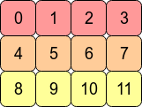
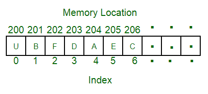
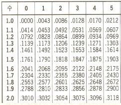

# **01 배열 (Array)**

## **1\. 탄생 배경**

배열은 가장 오래된 자료구조 중 하나로써 특정 탄생 시기나 배경에 대한 정확한 기록을 찾기 어려웠다.
추정컨대 배열이라는 개념을 어느 시점에 누가 처음으로 만들어내서 지금까지 쓰고 있다기 보다는
이전부터 일렬로 데이터를 저장해서 읽고 쓰는 것이 매우 기초적인 행위이기 때문에 배경을 찾는 의미가 없는 건 아닐까 싶다.

저장장치가 생기기 전의 컴퓨터에서 사용한 테이프 (magnetic tape나 구멍 뚫린 종이 테이프)도 아주 넓은 의미에서 배열의 범주 안에 들어간다고도 할 수 있지 않을까? 그만큼 배열의 형태는 매우 보편적인 아이디어라고 할 수 있는 것 같다.

다만 direct access가 가능한 배열은 컴퓨터 하드웨어에 내장 메모리가 등장하기 시작하면서 우리가 현재 아는 배열의 개념이 정립된 것으로 보인다.

## **2\. 배열이란 무엇인가?**

(위키피디아)
정의: 배열은 원소의 집합으로서 각 원소는 최소 하나의 키 값으로 정의할 수 있어야 한다.
또한 원소의 키 값을 수식에 대입하여 위치(주소)를 알아낼 수 있어야 한다.

위의 정의에 따르면 배열에 저장된 원소들의 순서대로 연속된 물리적 공간에 저장되어야 한다는 말이 없다. 대부분의 배열은 연속성을 가져야 하지만, 그 연속성의 정의가 조금 다른 경우가 있다.



우리가 보통 알고 있는 배열의 형태는 C Contiguous array 라고 한다.
이는 행의 기준으로 메모리 주소가 연속된다는 뜻이다. 위 2차원 배열의 형태가 실제 메모리 상으로 다음과 같이 저장되는 것이다.


반대로 Fortran Contiguous array가 있다. 실제 Fortran언어에서는 배열의 열을 기준으로 메모리에서 저장하기 때문에 다음과 같은 형태이다.


그럼 무엇이 더 효율적일까? 이건 상황에 따라서 다르다. Cache locality 측면에서 생각해보면 많이 접근하는 메모리가 서로 붙어있을 수록 유리하다. (CPU가 RAM에서 값을 가져올 때 그 값의 근처 주소들의 값도 같이 가져와서 caching 하기 때문에) 그렇기 때문에 만약 행을 기준으로 하는 연산을 자주 한다면 C contiguous, 열을 기준으로 하는 연산이 많다면 Fortran Contiguous를 사용하는 것이 유리할 것이다.

```
np.sum(arr, axis=1) # sum the rows
```

위의 코드가 아래의 코드보다 더 빠르다.

```
np.sum(arr, axis=0) # sum the columns
```


배열의 타입, index를 알면 배열 원소의 주소를 알아낼 수 있다.
(6번째 원소 'C'의 주소(206) = 시작주소(200) + offset(6) X 각 원소 크기(1)

**배열의 성능**


## **3\. 핵심 원리와 응용**

배열에서 가장 중요한 원리는 direct access(random acess라고도 한다)이다.
배열의 성능을 흔히 최악의 경우 base address부터 시작해서 끝까지 탐색하기 때문에 O(n)이다 라고 한다.
하지만 이건 말 그대로 최악의 경우이다. 실제 배열을 사용하는 프로그램이나 OS 내부를 보면 배열의 특성인 direct access를 최대한 활용한 흔적들이 보인다.
Direct access란 메모리의 주소만 지시하면 바로 데이터에 접근 할 수 있는 것을 말한다.
예를 들면 1부터 10까지 저장된 배열이 있을 때, 만약 5가 가운데에 저장되어 있는 것을 사전에 안다면 바로 arr\[4\] = 5로 O(1)의 시간 안에 접근할 수 있다는 의미다.

시간복잡도에서 O(1) 보다 더 빠른 것은 없다. 그렇기 때문에 배열은 각 원소의 위치를 이미 알고 있다면 그 어느 자료구조보다 가장 좋은 효율을 낼 수 있다.

이 direct access를 가장 잘 활용한 배열이 바로 LUT (Lookup Table)이다.
고등수학 상용로그표가 바로 이 LUT의 일종이다.


찾고자 하는 수의 위치를 알면 바로 상용로그의 값이 테이블에 미리 정리되어 있기에 바로 값을 찾을 수 있다. 이와 같이 실제 초기 컴퓨터들은 이 원리를 사용하여 배열을 활용했다. 특정 프로그램을 기동할 때 , 자주는 쓰는 연산의 결과를 미리 테이블에 저장하여 실행 시 테이블의 값을 불러오는 방식으로 동작했다.

여기까지 보면 이건 배열의 설명이 아니라 Associative Array 즉, 해시에 대한 설명이 아닌가 했다. 단순한 배열은 Key값이 바로 index 이기 때문에 key를 다양한 형태로 사용하면서도 이 direct access를 계속 사용하고 싶어서 탄생한 것이 바로 Hash와 관련된 자료구조들인 것이다.

참고 자료 :
[https://en.wikipedia.org/wiki/Array\_data\_structure#History](https://en.wikipedia.org/wiki/Array_data_structure#History)
https://www.techtarget.com/searchstorage/definition/direct-access
https://www.geeksforgeeks.org/array-data-structure/
https://stackoverflow.com/questions/26998223/what-is-the-difference-between-contiguous-and-non-contiguous-arrays