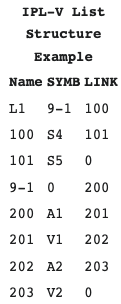
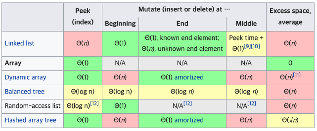
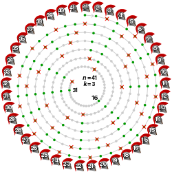
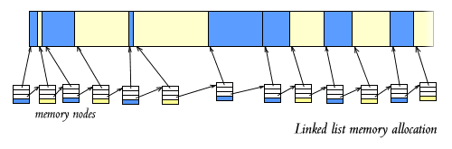

# **02 연결 리스트**

## **1\. 탄생 배경**

연결리스트에 대한 첫 언급은 1955-1956년에 개발된 IPL이라는 언어의 기본 자료구조로 등장한다.
이 IPL은 복잡한 수식을 증명하는 용도로 개발이 되었는데 간단히 설명하자면 이 언어에서 사용되는 변수들의 계층을 나누기 위해서 사용된 것으로 보인다. 어떤 변수들은 그 스코프가 전역적이고 또 어떤 특정 변수들은 스코프가 내부적으로 이루어져 있는데 이 각 값들을 어떤 변수의 이름으로 접근할 수 있도록 연결 리스트가 사용되었다고 한다.

## **2\. 연결 리스트란 무엇인가**

정의: 한 줄로 연결되어 있는 방식으로 어떤 데이터 덩어리(이하 노드Node)를 저장할 때 그 다음 순서의 자료가 있는 위치를 데이터에 포함시키는 방식으로 자료를 저장한다. 즉 리스트의 순서가 메모리에서의 실제 저장 위치에서는 일관되지 않다는 것이다.

가장 단순한 형태의 연결리스트는 각 노드에 값, 그리고 다음 값에 대한 reference로 나타난다.

**연결리스트의 성능**

동적 배열과의 차이점은 dynamic array는 말 그대로 배열이기 때문에 메모리에서의 연속성이 보장된다. 다만 크기의 변경이 일어날 때 배열 전체를 복사해서 새로 할당하기 때문에 매우 연산의 비용이 매우 비싸다.

연결리스트는 이에 비교하면 몇가지 이점을 가진다. 삽입과 삭제가 O(1)이다(삭제, 삽입 연산 자체의 복잡도를 의미한 것) 또한 삽입을 가용 가능한 메모리 만큼 자유롭게 할 수 있다.

반면 단점은 명확하다. 탐색을 할 시엔 무조건 처음부터 찾아야 하기 때문에 O(n)이다. 또한 배열과는 다르게 다음 원소에 대한 정보를 담는 reference가 필요하기 때문에 메모리 공간도 더 차지한다.

동적 배열과 연결 리스트의 장단점을 가장 단적으로 나타나는 문제가 바로 요세푸스 문제이다.

n과 k가 자연수이고, k < n이라고 가정한다. n명이 동그랗게 모여있을 때 임의의 한 명부터 순서를 세어 k번째 사람을 모임에서 제외한다. 남은 n-1명에서 다시 다음 사람부터 순서를 세서 k번째 사람을 모임에서 제외한다. 이것을 아무도 남지 않을 때까지 계속해서 반복한다. 이때 모임에서 제외되는 사람의 순서를 (n, k) 요세푸스 순열이라고 하며 마지막으로 제외되는 사람을 구하는 문제를 요세푸스 문제라고 한다.

여기서 연결 리스트를 사용하면 제외할 때 O(1)로 할 수 있지만, 다음 삭제 대상에 대한 탐색은 무조건 선형 O(n) 시간을 가진다. 반대로 동적 배열은 다음 삭제 대상에 대한 탐색은 O(1)이지만 삭제 할 때는 O(n)의 복잡도를 가진다.

이러한 한계점을 가지고 있는 연결리스트를 계속해서 발전 시키는데 그 다음이 바로 트리 자료구조다.

## **3\. 핵심 원리와 응용**

내가 생각하는 연결리스트의 핵심 원리는 바로 연결성이다.
즉 가장 큰 장점은 어떤 하나의 공통적인 논리 단위의 데이터가 연속된 공간에서 존재하지 않아도 된다는 점이다. 이는 메모리 공간을 굉장히 유연하게 사용 할 수 있다는 뜻이다.

배열의 경우 연속된 메모리공간에 저장된다는 점에서 cache locality와 같은 원칙이 적용이 되는 환경에서 장점으로 적용이 될 수 있다. 하지만 sparse matrix에서의 문제점에서 볼 수 있듯이 메모리 공간을 차지하는 만큼의 효용성이 나타나지 않으면 이것은 낭비가 된다. 연결리스트는 이런 걱정을 할 필요 없다. 비어있는 공간은 무조건 사용할 수 있기 때문이다.

이런 특성을 가장 잘 활용한 사례가 바로 힙 메모리 관리이다.

SYSLINUX의 malloc 함수의 상세에 따르면 다음과 같다.

The list of free blocks is traversed, until a block that would fit both the requested size plus the size of the block header is found. If no such block is found, malloc() returns NULL. Note that there might be sufficient total free memory available for the request (dispersed throughout the free blocks), but if the requested amount is not found in a single continuous block, the allocation fails.

요약하자면 할당할 수 있는 크기의 블록을 찾을 때 까지 탐색하고, 존재 하면 그 블록을 리턴하고 그렇지 않으면 NULL을 반환한다. 즉 free memory 에 대한 데이터를 doubly linked list로 저장한다는 것이다.

참고자료:
https://en.wikipedia.org/wiki/Linked_list
[https://en.wikipedia.org/wiki/Information\_Processing\_Language](https://en.wikipedia.org/wiki/Information_Processing_Language)
https://en.wikipedia.org/wiki/Josephus_problem
https://wiki.syslinux.org/wiki/index.php?title=Heap_Management