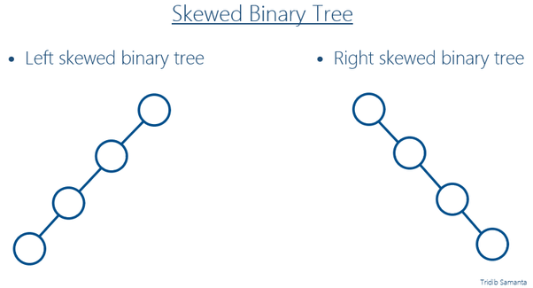

# **05 이진 탐색 트리(BST)**

## **1\. 탄생 배경**

BST는 1960년도 자기 테이프에 label된 데이터를 저장하기 위해 고안되었다고 한다.

## **2\. BST란 무엇인가?**
이진 탐색 트리(BST: binary search tree)는 다음과 같은 속성이 있는 이진 트리 자료 구조이다.
- 각 노드에 값이 있다.
- 값들은 전순서가 있다.
- 노드의 왼쪽 서브트리에는 그 노드의 값보다 작은 값들을 지닌 노드들로 이루어져 있다.
- 노드의 오른쪽 서브트리에는 그 노드의 값보다 큰 값들을 지닌 노드들로 이루어져 있다.
- 좌우 하위 트리는 각각이 다시 이진 탐색 트리여야 한다.

BST는 원소의 삽입 순서에 따라 그 성능의 변형이 심하다. 최악의 경우 scewered tree가 나오며 이는 결국 탐색 시간을 O(n)으로 떨어뜨린다.

## **3\. 핵심 원리와 응용**
BST의 핵심 원리는 바로 binary logarithm이다.
이것은 binary search 와도 유사한데 바로 탐색할때 나머지 반을 버려도 된다는 것이다.
BST가 balanced 상태라면 각 subtree의 높이가 비슷하다는 것인데, 밑으로 traverse 할 때 마다 나머지 반의 node들을 방문하지 않아도 되는 것이다.

이 binary logarithm이 최대한 보장될 수 있도록 balance를 유지하기 위해 여러 bst의 변형들이 등장한다.

https://en.wikipedia.org/wiki/Binary_search_tree
