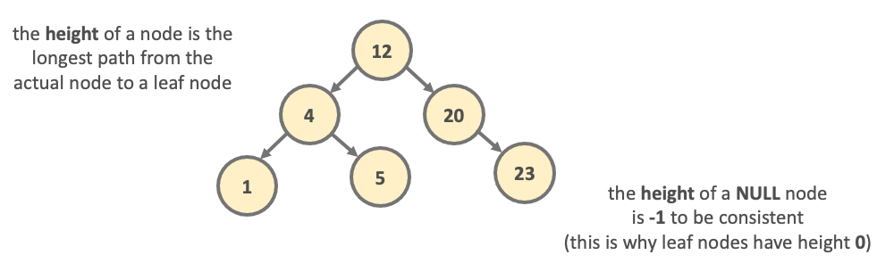
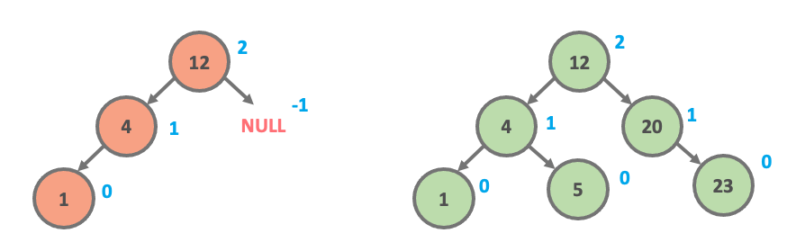
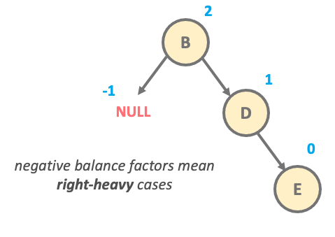
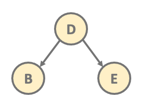
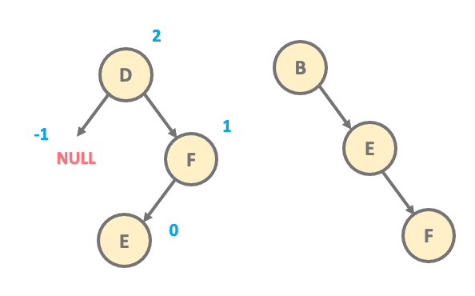
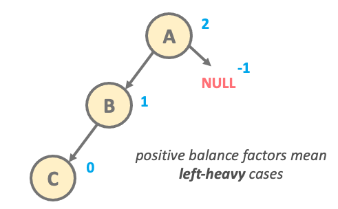
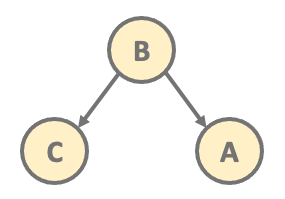
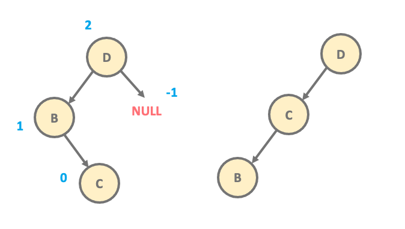

# **06 AVL 트리**

## **1\. 탄생 배경**

Adelson, Velsky and Landis, 이 트리를 고안한 세 사람의 이름 따온 트리이다. 
AVL 트리는 스스로 균형을 잡는 데이터 구조 중 최초이다.
1960 논문 "An algorithm for the organization of information", 말 그대로 정렬된 데이터를 유지하기 위해 고안되었다.

## **2\. AVL Tree란 무엇인가?**

정의: AVL 트리는 다음과 같은 속성을 가진 BST 이다.
- 높이 균형 성질(height-balance property): 트리 T의 모든 내부 노드(internal node) v에 대하여 v의 자식 노드들의 높이 차이가 최대 1이다.

AVL 트리는 모든 연산 마다 balance를 확인하고, 만약 imbalance할 경우 Rotation을 수행하여 balance를 유지한다.

노드의 높이는 다음과 같다.

따라서 이 heigh의 값으로 아래의 트리가 balance한 상태인지 imbalance한 상태인지 확인할 수 있다.

balance factor 가 음수일 경우 -> right heavy
balance factor 가 양수일 경우 -> left heavy

이 재구성 방법은 T의 부모-자식 관계만을 바꾸는 것이기 때문에 O(1) 시간이 걸린다.

## **Rotation**
**1. Left Rotation**
    balance factor < 0 => right heavy
	
**L1:** 

**L2:**

**2. Right Rotation**
    balance factor > 0 => left heavy
**R1:**

**R2** :

## **3. 핵심 원리와 응용**

주로 insert/delete가 적은 데이터베이스 관련 어플리케이션에서 많이 쓰인다.

https://en.wikipedia.org/wiki/AVL_tree