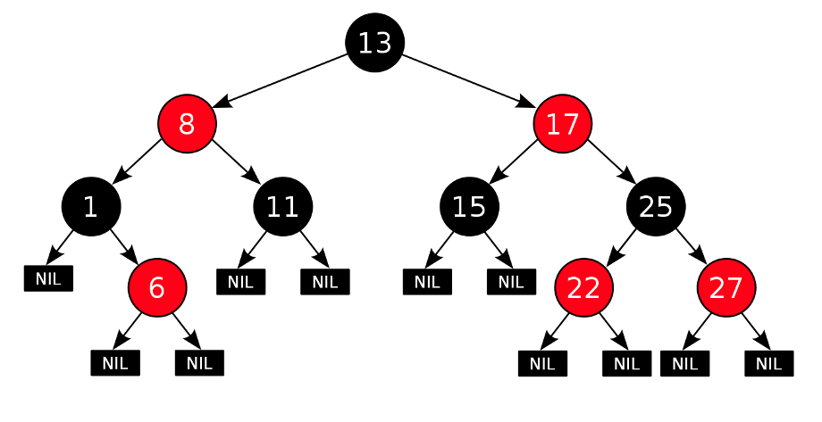
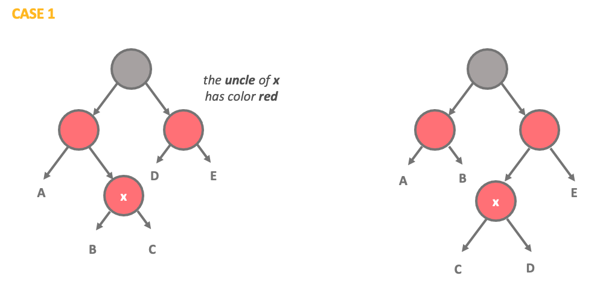
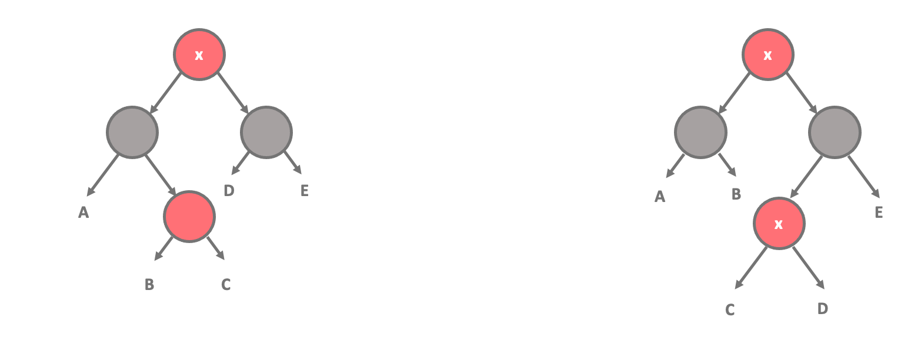
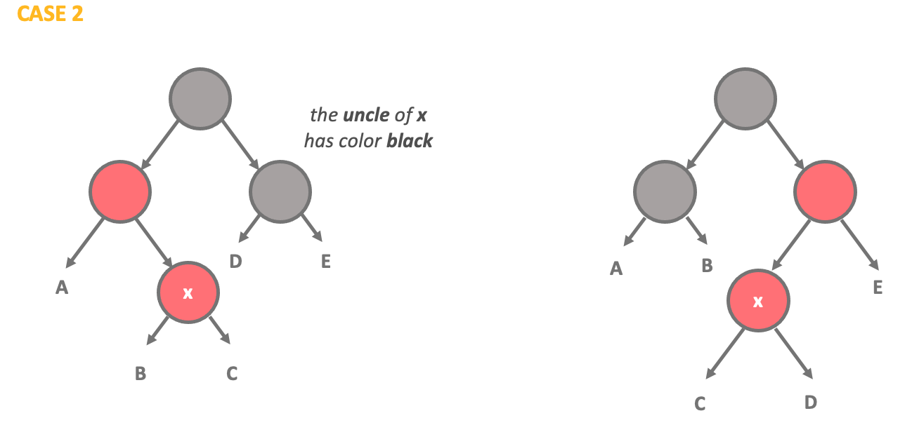
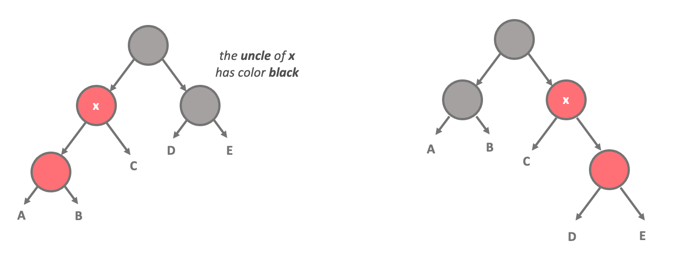
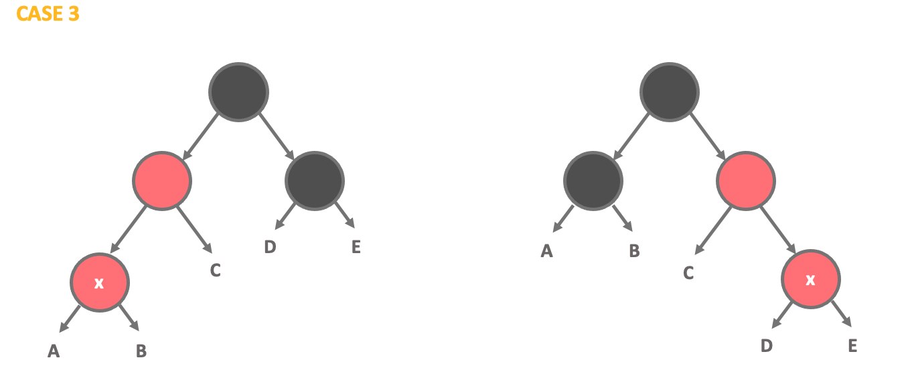
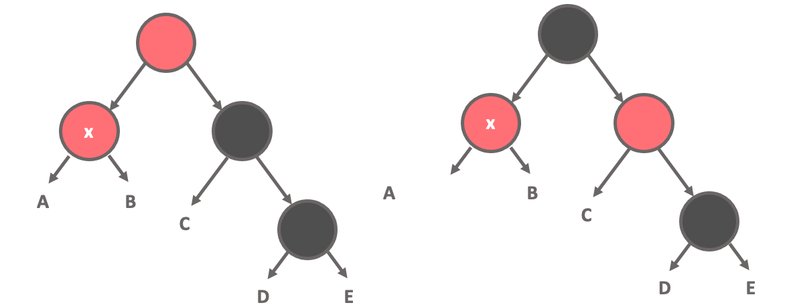
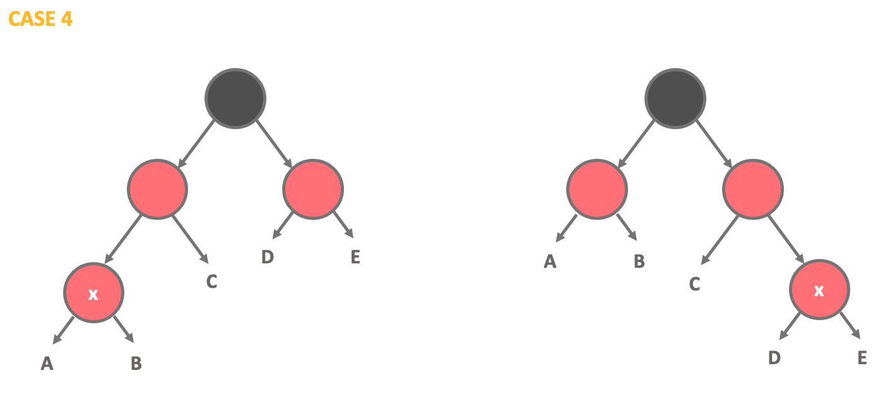
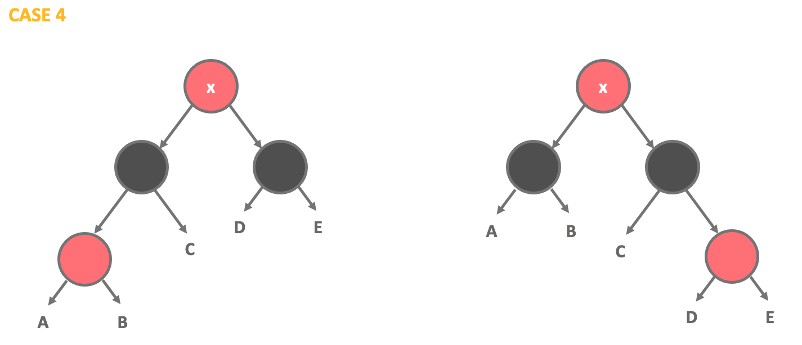

# **07 Red Black 트리**

## **1\. 탄생 배경**
1972: Rudolf bayer : root 에서 leaf까지 모두 같은 수의 노드를 가지게 하는 트리 고안
1978: Leonidas J. Guibas, Robert Sedgewick red-black 트리 고안
1993: Arne Andersson insert, delete operation 간소화
1999 ~ 2001 : unbalance 케이스 간소화

1972 balance factor를 정의했고 그 후엔 balance를 유지하는 방법 최적화

## **2\. RB Tree란 무엇인가?**
정의: AVL 트리는 다음과 같은 속성을 가진 BST 이다. 
1) 모든 노드는 Red or Black
2) Root는 항상 Black
3) 모든 leaf 노드는 Black
4) **한 노드에서 Leaf까지 가는 모든 경로들의 black 노드 개수가 동일**
5) 모든 red node는 2 black 노드를 자식으로 가진다.
6) 새롭게 insert되는 노드는 red
7) 매 Insertion 마다 위 속성들을 위배하는 지 확인한다.

## **Rotation**

**Recoloring**

**Rotation**

**Recoloring**

## **3\. 핵심 원리와 응용**

RB Tree의 핵심 원리는 balance factor에 있다.
4) 속성으로 인해 longest path <= 2 X shortest path

**CFS 스케줄러**

공평한 CPU 시간
만약 A, B 두 개의 태스크가 진행되고 있다면 A와 B의 CPU 사용시간은 항상 1:1로 같아야한다.

그러나 두 태스크가 번갈아 가며 수행되므로 임의의 시점에 두 태스크의 CPU 사용 시간이 항상 1:1로 같을 수 없다.

따라서 CFS는 정해진 ‘시간 단위’로 봤을때 시스템에 존재하는 태스크들에게 공평한 CPU 시간을 할당하는 것을 목표로 한다.

만약 1초를 ‘시간 단위’로 한다면 0.5초 동안 A 태스크를 수행시키고, 그런 뒤 0.5초간 B 태스크를 수행시킴으로써 1초가 지난 이후 A와 B의 CPU 사용시간이 1:1이 되도록 하는 것이다.

CFS의 기본 개념은 작업에 프로세서 시간을 제공할 때 밸런스(공평성)를 유지하는 것이다.

즉 프로세스에 공평한 양의 프로세서(=CPU)가 제공되어야 한다.

작업 시간의 밸런스가 무너진 경우에는(다른 작업에 비해 하나 이상의 작업에 공평한 양의 시간이 주어지지 않은 경우) 작업 시간이 적게 지정된 작업에 실행 시간이 주어져야 한다.

