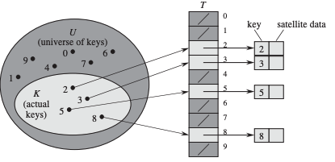
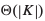
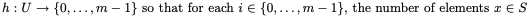
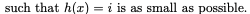
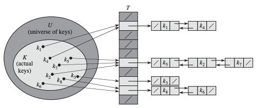
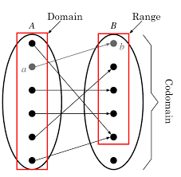
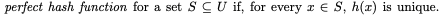
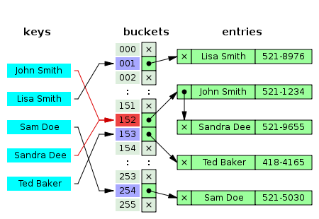
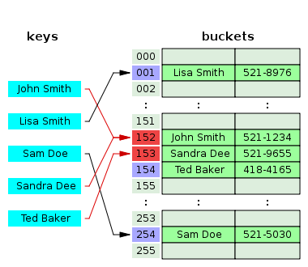
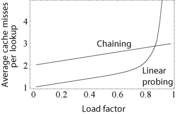

# **09 Hash Table**

## **1\. 탄생배경**

1953: Hans Peter Luhn이 IBM 내부 메모 테이블을 chaining 방식을 채택한 해싱 구현함.

비슷한 시기에 IBM Research에서 IBM 701 어셈블러에 사용될 해싱 구현

Arnold Dumey가 % prime number 방식으로 해싱을 하고 chaining으로 보완한 방식을 처음으로 선보였다.

초기엔 모두 chaining 방식으로 구현 했고 이후에 open addressing으로 넘어간 것으로 보인다.

## **2\. Hash Table이란 무엇인가?**

짚고 갈 포인트 4개

1.  Hash Function과 Integer universe assumption
    
2.  Collision 해결책: Separate Chaining
    
3.  Collision 해결책: Open Addressing
    
4.  성능에 대한 고찰
    

**1) Hash Function**

직관적인 정의: h(x)는 키를 배열의 인덱스로 변환하는 함수이다. (즉 키값을 인덱스로 매핑을 해준다)

이 정의에 대해 조금 더 깊이 파고들면 매우 수학적인 정의를 만나게 된다.

그리고 그 수학적 정의에서 해시가 어떻게 해서 나오게 되었는가에 대해 알 수 있게 된다.

어떤 키 집합이 매우 한정된 수로 존재한다고 가정해보자. 이 키의 전체 집합 U를 다음과 같이 정의한다. U = {0, 1, ...., m-1} (m은 매우 크지 않은 수)

이 집합을 나타내기 위해 우린 배열을 사용할 수 있다. 그리고 이 배열을 direct-access table이라 부른다. 이 배열은 T라고 나타내며, T\[0... m-1\]의 각 위치는 집합 U의 원소들과 각각 일대일 대응을 이룬다. 만약 U에 존재하지 않는 키 k가 존재한다고 할 때, T\[k\] = NIL이다.

이 direct-access table의 문제점이 무엇일까? 바로 U의 크기에 있다. 만약 U가 매우 큰 숫자라면 |U| 크기의 배열 T를 저장하는 것은 매우 비효율적이다. 즉, 컴퓨터의 메모리 측면에서 말한다면 T는 매우 sparse한 배열이 될 것이며, 메모리 낭비가 매우 심각해지고, 구현이 불가능한 수준에 이른다. 이를 다른 말로 표현한다면 실제 의미가 있는 U의 부분집합 K가 만약 U와 비교할 때 크기가 매우 작다면, 실제 필요한 T의 저장공간을  로 줄일 수 있다.

하지만 이렇게 축소하는 과정에서 만나는 문제점은 바로 direct-access에서 무조건 O(1)이 보장되던 성능이 이 과정을 통해 average-case O(1)으로 변한다는 것이다.

Hash function이란, 위의 일련의 축소과정을 의미하는 것이다. 즉,

Hash function은 U를 해시테이블 T\[0,1,....,m-1\]로 매핑시켜주는 함수인 것이다. 결과적으로 메모리 낭비를 줄여줌과 동시에, 기존 O(1)을 최대한 살리려고 하는 것이 hash function의 목적이다.

이 hash function 정의, 즉 Hash table의 원리는 두 가지로 나뉜다. 바로 integer universe assumption와 random probing 두가지다.

**Integer universe assumption**

키의 전체집합 U = {0,....u-1}, h(x)를 정의역 U를 치역 {0,....,m-1} m<=u 로 정의할 수 있다.

**Random Probing**

Next we consider hash table implementations under the random probing assumption: Each element x stored in the hash table comes with a random sequence x0, x1, x2,... where each of the xi is independently and uniformly distributed in {1,...,m}.

**Seperate Chaining**

**Open Addressing**

**성능에 대한 고찰**

\- 지난 시간까지 공부한 트리까지 생각해보면, 만약에 우리가 찾고자 하는 원소 x가 집합 S에 존재하지 않을 때, x에 가까운 수를 찾을 수 있다.

(x보다 큰 S내에서 가장 작은 원소 / x보다 작은 S내의 가장 큰 원소) -> 해시는 이런거 버리고 정확한 탐색만 행한다.

\- 반대로 없다는 걸 인지하는 것도 O(1)안에 알아낸다.

## **3\. 핵심 원리와 응용**