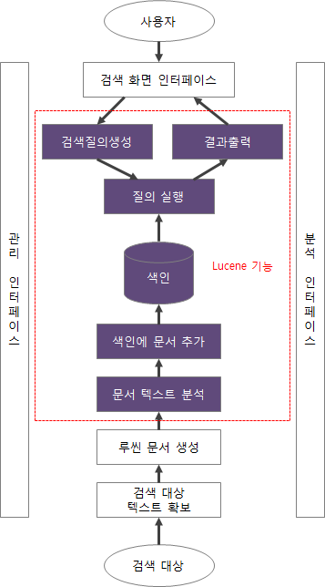
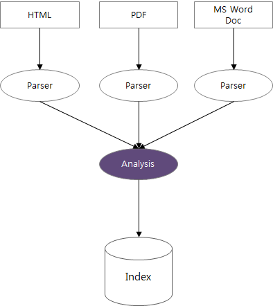
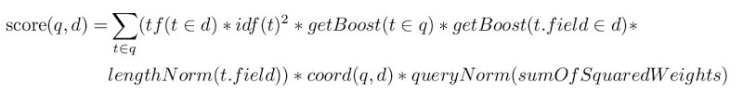
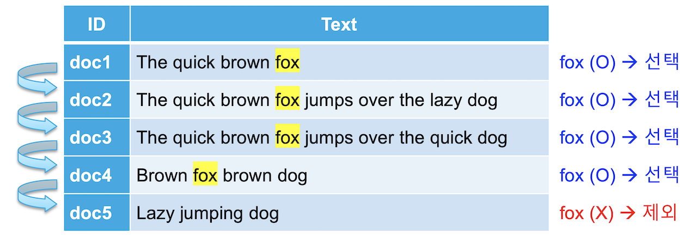
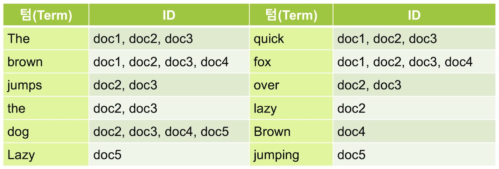

# Elasticsearch

## **1\. 탄생 계기**

2004년 샤이 배논(Shay Banon)은 Compass 라는 이름의 오픈소스 검색엔진을 개발.아파치 루씬(Apache Lucene)을 적용하려던 중 루씬이 가진 한계를 보완하기 위해 탄생됨.

**Lucene VS Elasticsearch**

|     |     |
| --- | --- |
| Lucene | Elasticsearch |
| Information Retrieval 라이브러리 | Lucene 기반 : 대부분 기능 다 포함 |
| API를 통해 전문 색인과 검색 가능 | 색인 완료 -\> 동시에 검색 지원 |
|     | 멀티 노드, 분산 데이터베이스 시스템 |
|     | 색인 포멧 모두 JSON |
|     | Rest API, URI 기반 |
|     | 추가 플러그인 많음 |

그래서 왜 루씬 말고 엘라스틱? =\> 완성된 데이터베이스 솔루션

## **2\. 검색엔진 : 색인과 검색**



**색인:** 데이터가 검색될 수 있는 구조로 변경하기 위해 원본 문서를 검색어 토큰들으로 변환하여 저장하는 일련의 과정

**Lucene의 색인 절차:** Parse -> Analysis -> Index



**Parse :** 원본 document에서 text 추출하고 Document로 만드는 과정

**Analysis:** Text를 Term으로 변환하는 과정. Term은 단어의 형태소 정도로 보면 된다. (기본형으로 바꾼다는 뜻)

```
입력문장 : “The quick brown fox jumped over the lazy dog”
· WithespaceAnalyzer
[The] [quick] [brown] [fox] [jumped] [over] [the] [lazy] [dog]
· SimpleAnalyzer
[the] [quick] [brown] [fox] [jumped] [over] [the] [lazy] [dog]
· StopAnalyzer
[quick] [brown] [fox] [jumped] [over] [lazy] [dog]
· StandardAnalyzer
[quick] [brown] [fox] [jumped] [over] [lazy] [dog]

* 아시아 언어(CJK : 한국어, 중국어, 일본어)에 대해  유의미한 분석 가능한 분석기
   -  StandardAnalyzer

* 루씬 contlib에서 지원하는 분석기를 이용하여 아시아 언어 분석 가능
   -  CJKAnalyzer (한글에서 가장 많이 사용하는 분석기)
   -  ChineseAnalyzer
   -  SmartChineseAnalyer
```

**검색:** 색인에 들어있는 토큰을 기준으로 해당되는 토큰이 포함된 문서를 찾아내서 사용자 관점의 우선순위를 부여


```
Score (연관도 점수)

루씬 검색의 가장 핵심적인 특징으로, 검색과정에서 질의에 해당하는 문서를 찾아낼 때마다 해당 문서가 질의에 얼마나 비슷하게 일지하는지 점수 부여하는 과정

루씬의 연관도 점수 계산 공식
· TF (Term Frequency)
  -  문서(d)의 텀(t)에 대한 term 빈도수
  -  해당 문서에서 term이 몇번이나 나타나는지를 뜻함
· IDF (Inverse Document Frequency)
  -  해당 term에 역 빈도수
  -  흔한 단어일 수록 idf값이 낮아지고 찾아보기 힘든 단어일수록 idf값이 높아짐
· COORD (Coordination factor)
  -  질의에 지정된 term 중 특정 문서에 포함된 term의 개수에 따라 정해지는 조율
  -  질의에 해당하는 term을 더 많이 포함하고 있는 문서일수록 높음
· lengthNorm
  -  필드 안에 속한 term의 개수를 정규화한 값
  -  필드 원문의 길이가 짧은 문서가 더 높은 유사도 점수를 받음
· queryNorm
  -  질의의 각 term에서 중요도의 제곱 합을 정규화한 값
· boost(index)
  -  색인 시 특정 문서에 가중치를 적용
· boost(query)
  -  검색 시 특정 검색어에 가중치 적용
```

## 3\. Inverted Index

일반 RDBMS에 밑의 데이터에서 LIKE "fox" select 한다고 가정해보자


데이터가 늘어날 수록 매우 느림 -\> 모든 row를 다 봐야되니까

역색인 구조는 이런 문제점을 해결해준다.



역색인 구조인 Elasticsearch에서는 데이터가 늘어가도 행이 추가되는 것이 아니라 역인덱스가 가리키는 id의 배열값이 추가되는 것. 큰 속도의 저하 없이 빠른 속도로 검색이 가능. 따라서 데이터를 저장한다고 하는 것이 아니라 색인 한다고 표현함.