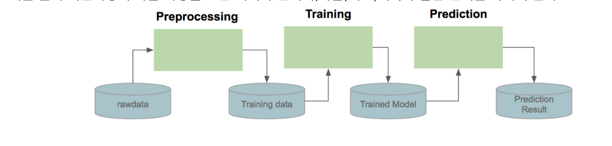

# Airflow란?
머신러닝을 예로 들면, "데이터 전처리" -> "학습" -> "배포"와 같은 단계를 거치게 된다. 이 처럼 단계가 끝나면 다음 단계가 수행되거나, 실패 시 재시도를 하거나, 특정 단계의 결과에 따라 분기를 하는 등 단순 스케줄러 이상의 작업 흐름을 만들어야 할 때 Airflow 같은 워크플로우를 사용한다.



# Airflow 구조
Airflow는 크게 아래와 같은 구조를 가지고 있다.


1. Metadata Database
- Airflow는 작업의 상태 등을 저장하기 위해 DB를 이용한다. 주로 mysql, postgresql을 사용한다.

2. Scheduler
- 예약된 워크플로우(DAG) 혹은 1개의 특정 단일 작업을 시작하는 신호를 보내는 역할을 한다. Executor한테 제출해서 실행한다.

3. DAG Directory
- Airflow에서 DAG는 파이썬 프로그램으로 작성된다. 이 DAG 파일들을 모아놓는 폴더이다. 스케줄러는 정기적으로 폴더를 검사하여 DAG를 새로 추가한다.

4. Worker
- Airflow 작업들이 수행되는 공간이다.

5. Webserver
- UI로 쉽게 DAG들을 관리할 수 있도록 웹 서버를 제공한다.

# Airflow 코드 용어
1. DAG (Direct Acyclic Graph)
- 하나의 워크플로우를 의미한다. 머신 러닝을 예로 들면, "데이터 전처리" -> "학습" -> "배포"가 하나의 워크플로우다. 

2. Task와 Operator
- Operator는 DAG안에서 정의되는 작업 함수(함수임을 주의하자) 이야기한다. 머신로닝을 예로 들면 "데이터 전처리", "학습", "배포" 각 함수들이 Operator다. 그리고 이 Operator를 인스턴스화 한게 Task라 보면된다. 자바로 치면 Operator는 클래스고, Task는 인스턴스다. Airflow에는 파이썬 코드를 실행 하는 Python Operator, 쉘 스크립트를 실행하는 Bash Operator와 같이 여러 Operator들이 있다.

# Airflow 코드 예제
```python
from airflow import DAG
from airflow.operators.bash_operator import BashOperator
from airflow.operators.dummy_operator import DummyOperator
from airflow.operators.python_operator import PythonOperator
from datetime import datetime,timedelta

dag = DAG('hello-airflow',description='Hello airflow DAG',
          schedule_interval = '*/5 0 * * *',
          start_date=datetime(2017,07,01),catchup=False)

def print_hello():
    return 'Hello Airflow'

python_task = PythonOperator(
                    task_id='python_operator',
                    python_callable = print_hello,
                    dag = dag)

bash_task = BashOperator(
        task_id='print_date',
        bash_command='date',
        dag=dag)

bash_task.set_downstream(python_task)
```

## Web UI 결과
