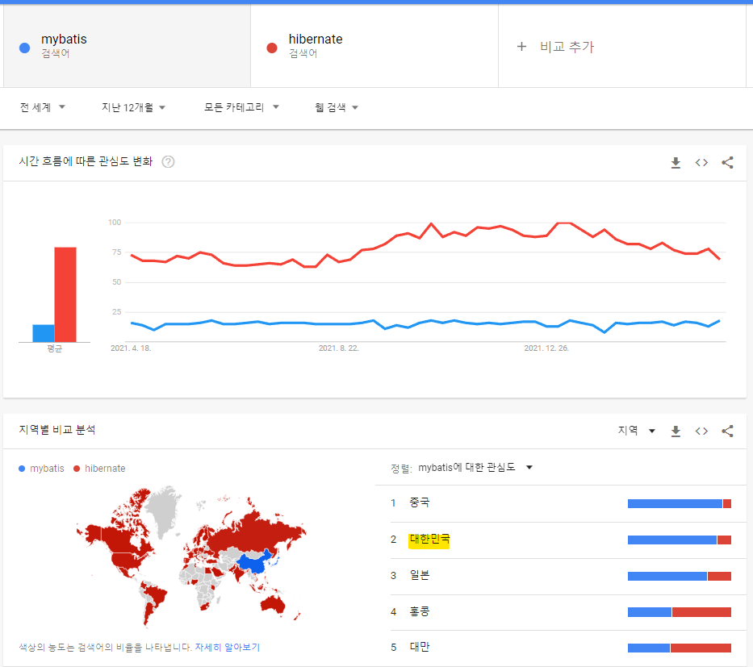
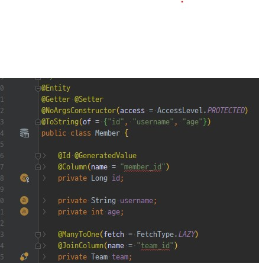
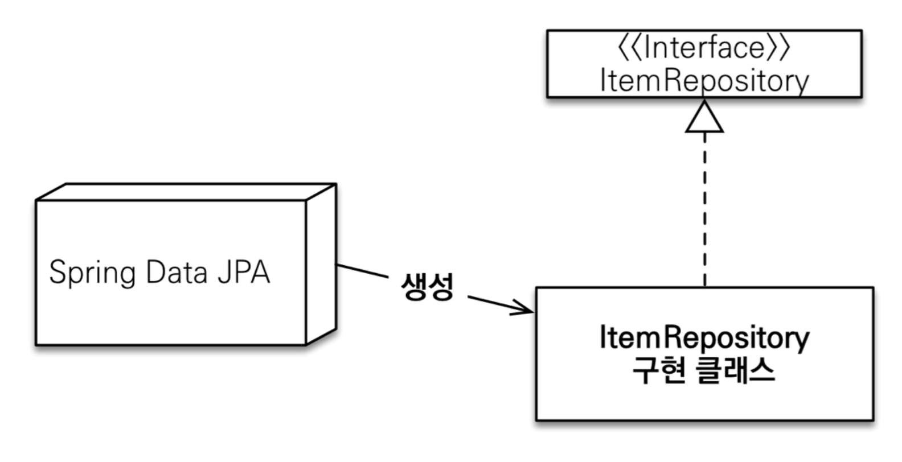

# Spring Data JPA & Querydsl 적용기

## 스터디 목표

- 자바 진영의 영속성 프레임워크 중 ORM 기술 표준인 JPA에 대하여 알아보자
- 직접 프로젝트에 적용해보며 SQL Mapper와 차이점을 느껴본다
- SQL Mapper 방식과 성능 비교를 통해 적용 가능성을 파악한다



---

# 1. JPA(Java Persistence API)

- Java의 영속화 방법중 ORM 기술의 표준 API.
- 구현체로 Hibernate, EclipseLink, DataNucleus가 있으며 가장 대중적이고 스프링이 채택한것은 하이버네이트(Hibernate)이다.
- RDBMS 중심적인 개발과 객체 중심적 개발이라는 패러다임의 차이를 해결하기 위해 만들어졌다.
- 직접 DB에 통신하지 않고 JDBC를 통해 동작한다.
- 개발자는 JPA 인터페이스에 맞춰 제공되는 기능을 사용한다.

## JPA의 장단점

### 장점

- 객체 중심 개발 - SQL 중심 개발에서 탈피. 패러다임 불일치 해결
- 생성산 증가 - 기본 CRUD 기능 제공
- 유지보수 - 스키마 변경시 Entitiy 객체의 수정만으로 해결 (SQL 수정 범위 감소)
- 성능 최적화 기능 제공 - 1차 캐시와 동일성 보장, 쓰기 지연, 지연로딩 제공
- 벤더 독립성 - 쿼리가 특정 데이터베이스 기술에 종속되지 않음. (Dialect만 명시)

### 단점

- 고도화 시키기 위해 알아야 할 것이 많다.
- 통계 쿼리와 같이 복잡한 SQL을 작성하기엔 적합하지 않다
    - Querydsl을 통해 복잡한 쿼리 작성 극복가능.
- 추상 계층이 추가됐기 때문에 SQL Mapper에 비해 성능이 떨어진다.

## 엔티티

- 엔티티는 JPA가 관리하는 테이블과 매핑할 클래스를 의미한다.
- 기본적인 CRUD 기능은 엔티티 단위로 제공되며, 제공되는 여러 애노테이션들을 통해 쉽게 매핑 정보를 등록할 수 있다.
    - @Entity - 테이블과 매핑할 클래스 엔티티로 등록
    - @Column - 엔티티 내 필드와 테이블 컬럼 매핑



## 영속성 컨텍스트(Persistence Context)와 엔티티 매니저

### 영속성 컨텍스트

- Entity의 데이터베이스 영속성을 관리하는 환경
- 애플리케이션 입장에서 추상화된 데이터베이스 저장소
- em.persist() 시점에 Entity를 DB에 저장하는것이 아니라 영속성 컨텍스트에 저장한다

### 엔티티 매니저

- 영속성 컨텍스트를 컨트롤하기위한 객체.
- 트랜잭션 단위로 생성되며, 엔티티 매니저가 생성되면 1:1로 영속성 컨텍스트가 생성된다 (동시성 보장).

## 영속성 컨텍스트의 이점

### 1차 캐시

- EntityManager 동작시 영속 상태의 엔티티는 영속성 컨텍스트에 저장한다. (EntityManager::persist)
- 영속성 컨텍스트에 key-value 형식으로 PK와 엔티티를 매핑해 놓는다.
- 이미 영속성 컨텍스트에 올라간 엔티티를 조회할 경우, 엔티티 매니저는 DB로 부터 조회하지 않고 영속성 컨텍스트를 통해 엔티티를 가져온다.

### 영속 엔티티의 동일성(identity) 보장 (== 비교)

- 1차 캐시로 반복 가능한 읽기 등급의 트랜잭션 격리 수준을 DB가 아닌 애플리케이션 차원에서 제공
- 지연 로딩을 위해 Proxy 객체를 반환 후 실 데이터가 조회된 이후에도, 재조회 시 동일성 보장을 위해 영속성 컨텍스트가 target이 채워진 Proxy 객체를 반환한다.

### 트랜잭션을 지원하는 쓰기 지연(transactional write-behind)

- 영속성 컨텍스트 내에 쓰기 지연 SQL 저장소를 두어 트랜잭션 commit(flush)시 한번에 쓰기를 요청한다.

### 변경 감지(Dirty Checking)

- 영속 상태의 엔티티는 영속성 컨텍스트가 추적한다
- 엔티티의 변경이 감지되면 영속성 컨텍스트에 엔티티의 스냅샷과 수정된 엔티티를 비교한다
- 비교하여 변경된 값이 있다면 UPDATE SQL을 생성하여 쓰기 지연 SQL 저장소에 UPDATE SQL을 생성한다.
- 쓰기 지연과 같이 트랜잭션 commit(flush)시 SQL문이 실행된다.

### 지연로딩(Lazy Loading)

- 연관관계를 갖는 엔티티에 대하여 지연 로딩을 지원한다.

---

# 2. [Spring Data JPA](https://docs.spring.io/spring-data/jpa/docs/current/reference/html/)

- 스프링 프레임워크에서 JPA를 편리하게 사용할 수 있도록하는 프로젝트.
- DAO 계층 개발 시 인터페이스만으로 개발을 완료할 수 있다 (이상적...).
- 애플리케이션 실행 시점에 Repository 인터페이스들을 찾아 해당 구현 클래스를 동적으로 생성하여, 스프링 빈으로 등록한다.
- 빈으로 등록된 구현 클래스를 주입받을수 있기에 개발시 인터페이스만 선언해서 개발하게된다. 



## dependency

> 필수 의존성 - Hibernate로 구현된 Spring Data JPA 의존성을 주입한다.

```xml
<dependency>
    <groupId>org.springframework.boot</groupId>
    <artifactId>spring-boot-starter-data-jpa</artifactId>
</dependency>
```

> Optional - Connection, Statement, ResultSet, SQL 쿼리 로깅을 위한 라이브러리
> - hibernate 에서 제공하는 옵션으로 쿼리 로깅이 가능하나 파라미터가 바인딩된 완성형 쿼리를 로깅해주어 실제 테스트에 사용하기 편하다.

```xml
<dependency>
    <groupId>com.github.gavlyukovskiy</groupId>
    <artifactId>p6spy-spring-boot-starter</artifactId>
    <version>${version}</version>
</dependency>
```

## Configuration

### AutoConfiguration

- 아래의 설정을 application.yml 파일에 넣어주면 JPA 사용을 위한 컴포넌트들이 빈으로 자동등록된다.
```yaml
spring:
  datasource:
    url: {url}
    username: ${username}
    password: ${password}
    driver-class-name: org.h2.Driver
  jpa:
    hibernate:
      ddl-auto: create # ddl 자동생성 옵션
    properties:
      hibernate: # hibernate 옵션
        show_sql: true
        format_sql: true
```

### 직접 설정

- 실무환경에서 둘 이상의 DB를 사용한다면 각 DB를 위한 `DataSource`, `EntitiyManager와` `TransactionManager`를 직접 등록해주어야 한다.
- @EnableJpaRepository - JPA Repository 등록을 위한 애노테이션. 스캔대상 repository 패키지와 EntitiyManager, TransactionManager를 등록가능하다.

```java
@Configuration
@EnableJpaRepositories(
        basePackages = {"com.example.jpa-test.repository"}, // 스캔대상 repository packages
        entityManagerFactoryRef = "entityManager",
        transactionManagerRef = "transactionManager"
)
public class JpaConfig {
 
    @Bean
    @Primary
    @ConfigurationProperties("datasource.mydb")
    public DataSource dataSource() {
        return DataSourceBuilder.create()
                .build();
    }
 
    @Bean
    @Primary
    public LocalContainerEntityManagerFactoryBean entityManager(EntityManagerFactoryBuilder builder) {
        // Hibernate 설정
        Map<String, Object> properties = new HashMap<>();
        properties.put(HBM2DDL_AUTO, Action.NONE); // 데이터 베이스 스키마 자동생성 속성 - none : 사용하지 않음
 
        return builder.dataSource(statdbDataSource())
                .properties(properties)
                .packages("com.example.jpa-test.entity")
                .build();
    }
 
    @Bean
    @Primary
    public PlatformTransactionManager transactionManager(LocalContainerEntityManagerFactoryBean entityManager) {
        return new JpaTransactionManager(entityManager.getObject());
    }
}
```

## 리파지토리 등록

- 스프링 데이터 JPA가 제공하는 JpaRepository 인터페이스를 상속하여 Repository 생성가능
- 이때 Repository는 위의 `@EnableJpaRepositories`에서 설정한 스캔대상 패키지에 위치해야만 한다.
- 등록한 Repository는 자동으로 빈으로 등록되기 때문에 주입받아 사용할 수 있다.

```java
public interface MemberRepository extends JpaRepository<Member, Long> {
}
```
> JpaRepository는 CRUD 관련 기능만을 제공하는 CrudRepository를 상속하며  추가로 JPA 관련 특화기능들을 제공한다.
> 그런 메소드들이 지원되지 않아도 되는 상황이며 구현 클래스가 무거워지지 않기 위해서는 CrudRepository를 구현하는것이 좋다.

## 쿼리 작성

###  Query Creation - 쿼리 자동생성

> 네이밍 룰을 따라 메서드를 생성하면 JPA의 쿼리 생성 메커니즘에 따라 자동으로 쿼리를 생성해준다.

```java
public interface MemberRepository extends JpaRepository<Member, Long>, MemberRepositoryCustom {

    // QueryCreation으로 자동으로 쿼리 생성
    List<Member> findByUsernameAndAgeGreaterThan(String username, int age);
}
```

### @Query

> 직접 JPQL을 작성하려한다면 @Query 애노테이션을 통해 JPQL을 작성할 수 있다.
> JPQL이 아닌 데이터베이스에 질의할 네이티브 쿼리를 직접 작성하고 싶다면 nativeQuery 옵션을 주고 작성할 수 있다.

```java
public interface MemberRepository extends JpaRepository<Member, Long>, MemberRepositoryCustom {

     // 직접 JPQL을 작성하고 싶다면 @Query 애노테이션을 통해 정적 쿼리를 작성 가능하다
    @Query("select m from Member m where m.username = :username and m.age = :age")
    List<Member> findUser(@Param("username") String username, @Param("age") int age);
 
    // nativeQuery
    @Query(value = "select * from member where username = ?1 and age = ?2", nativeQuery = true)
    int countDomainNativeQuery(String username, int age);
}
```

## 한계
- 복잡한 쿼리 작성시 결과적으로 SQL Mapper 방식을 따라가게됨.
- 동적쿼리 작성에 어려움 존재.

---

# [Querydsl](http://querydsl.com/)

- 쿼리를 자바 코드로 작성할 수 있게 도와주는 기술이다.
- 자바 코드로 작성하기 때문에 쿼리 문법 오류를 컴파일 시점에 잡아낼 수 있다.
- Spring Data JPA로 해결하지 못하는 한계(복잡한 쿼리, 동적 쿼리)를 해결할 수 있다

## dependency
```xml
<dependency>
    <groupId>com.querydsl</groupId>
    <artifactId>querydsl-jpa</artifactId>
</dependency>
<dependency>
    <groupId>com.querydsl</groupId>
    <artifactId>querydsl-apt</artifactId>
    <scope>provided</scope>
</dependency>
```

Querydsl로 개발을 하려면 Q-Class 가 필요하며, 이는 컴파일 시점에 생성된다. Q-Class 생성을 위해 Maven APT 플러그인도 등록해야한다.

`clean compile`을 통해 APT 플러그인은 Entity와 Embeddable 같은 쿼리에 사용될 애노테이션을 찾고 내용들을 분석하여 Q-Class를 생성한다.

컴파일 후 Q-Class들은 target/generated-sources/java 하위에 생성되며, 소스에서 이름 이용하여 querydsl 쿼리를 작성한다.

```xml
<plugins>
    <!-- querydsl configuration -->
    <plugin>
        <groupId>com.mysema.maven</groupId>
        <artifactId>apt-maven-plugin</artifactId>
        <version>1.1.3</version>
        <executions>
            <execution>
                <goals>
                    <goal>process</goal>
                </goals>
                <configuration>
                    <outputDirectory>target/generated-source/java</outputDirectory>
                    <!-- Entity 애노테이션이 추가된 도메인에 대해 outputDirectory 설정한 경로에 query type을 생성해준다 -->
                    <processor>com.querydsl.apt.jpa.JPAAnnotationProcessor</processor>
                    <options>
                        <querydsl.entityAccessors>true</querydsl.entityAccessors>
                    </options>
                </configuration>
            </execution>
        </executions>
    </plugin>
</plugins>
```

## 쿼리 작성
- 쿼리 작성시 JPAQueryFactory를 사용하며, EntityManager를 주입받아 JPAQueryFactory를 초기화 한다.
- ANSI SQL는 모두 지원되기에 필요한 키워드들을 자동완성하며 작성할 수 있다.

```java
@Repository
public class MemberRepository {
 
    private final JPAQueryFactory queryFactory;
 
    public DomainSpaceUsageStatRepository(EntityManager entityManager) {
        this.queryFactory = new JPAQueryFactory(entityManager);
    }
 
    /**
     * 특정 나이 멤버 수
     */
    public long countMemberByAge(int age) {
        final QMember member = QMember.member; // Q-Class 인스턴스 사용
        Long count = queryFactory.select(member.id())
                .from(member)
                .where(domainSpaceTotalStat.member.age.eq(age))
                .fetchOne();
        return count != null ? count : 0L;
    }
}
```

## Querydsl의 장단점

### 장점
- 동적 쿼리를 메서드를 이용해서 깔끔하게 작성가능하다
- 타입 안정성이 생긴다
- 자바 코드로 복잡한 쿼리를 작성 가능하다

### 단점
- Q-Class를 위해 Entity, Mapping 클래스 추가 하여 개발 시 컴파일을 해주어야한다 - 번거로움
- JPA에서 지원하지 않는 문법은 Querydsl에서도 불가하다
    - (ex. JPA에서 FROM 문의 서브쿼리 불가능하기에 Querydsl 로도 해결 불가능) → 서브 쿼리는 분할하여 해결가능

---

### 참고링크

- [인프런강의](https://www.inflearn.com/)
- [https://www.objectdb.com/api/java/jpa](https://www.objectdb.com/api/java/jpa)
- [https://gmlwjd9405.github.io/2019/08/04/what-is-jpa.html](https://gmlwjd9405.github.io/2019/08/04/what-is-jpa.html)
- [https://gmlwjd9405.github.io/2019/08/06/persistence-context.html](https://gmlwjd9405.github.io/2019/08/06/persistence-context.html)
- [https://www.baeldung.com/spring-data-jpa-multiple-databases](https://www.baeldung.com/spring-data-jpa-multiple-databases)
- [https://github.com/gavlyukovskiy/spring-boot-data-source-decorator](https://github.com/gavlyukovskiy/spring-boot-data-source-decorator)
- [https://docs.spring.io/spring-data/jpa/docs/current/reference/html/#repositories.core-concepts](https://docs.spring.io/spring-data/jpa/docs/current/reference/html/#repositories.core-concepts)
- [https://docs.spring.io/spring-data/jpa/docs/current/reference/html/#jpa.query-methods.query-creation](https://docs.spring.io/spring-data/jpa/docs/current/reference/html/#jpa.query-methods.query-creation)
- [http://querydsl.com/](http://querydsl.com/)
- [https://github.com/querydsl/querydsl/tree/master/querydsl-jpa](https://github.com/querydsl/querydsl/tree/master/querydsl-jpa)
