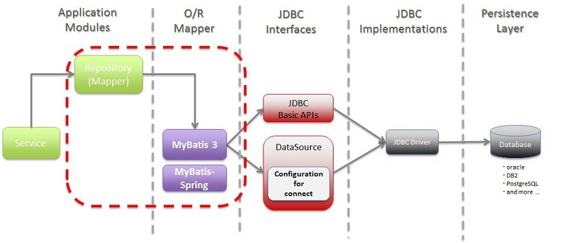

# MyBatis 개요와 특징

## MyBatis의 개요

> MyBatis is a first class persistence framework with support for custom SQL, stored procedures and advanced mappings.
> 

 → **자바 오브젝트와 SQL문 사이의 자동 Mapping 기능을 지원하는 SQL Mapper**

- **MyBatis**는 **SQL**을 **별도의 파일**로 분리해서 관리하게 해주며,
  
    **Object - SQL** 사이의 파라미터 **Mapping 작업**을 **자동**으로 해주고 있음
    
- **MyBatis**는 **Hibernate**나 **JPA(Java Persistence API)** 처럼 새로운 DB 프로그래밍 패러다임을 익혀야 하는 부담없이, 개발자가 익숙한 SQL을 그대로 이용하면서 **JDBC 코드 작성의 불편함도 제거**해주고, **도메인 객체나 VO 객체**를 **중심**으로 **개발**이 가능하다는 장점이 있음

## MyBatis의 특징

### 쉬운 접근성과 코드의 간결함

- 가장 간단한 영속성 프레임워크 (Persistence Framework)
    - Persistence Framework
      
        데이터베이스와의 연동되는 시스템을 빠르게 개발하고 안정적인 구동을 보장해주는 프레임워크
        
        - SQL Mapper SQL문장으로 직접 데이터베이스 데이터를 다루는 SQL Helper ( Mybatis )
        - ORM : 객체를 통해 간접적으로 데이터베이스를 다루는 ORM ( Hibernate, JPA )
- XML 형태로 및 Annotation으로 기술된 JDBC 코드
- 복잡한 JDBC 코드를 걷어 내며 깔끔한 소스코드 유지
- 수동적인 파라미터 설정과 쿼리 결과에 대한 맵핑 구문을 제거 가능

### SQL문과 프로그래밍 코드의 분리

- SQL에 변경이 있을 때마다 자바 코드를 수정하거나 컴파일 할 필요 없음
- SQL 작성과 관리 또는 검토를 DBA와 같은 개발자가 아니 다른 사람에 맡길 수 있음

### 다양한 프로그래밍 언어로 구현 가능

- Java, C#, .NET, Ruby

# MyBatis3와 MyBatis-Spring의 주요 컴포넌트

## MyBatis와 MyBatis-Spring을 사용한 DB Acess Architecture



## MyBatis3의 주요 컴포넌트


## MyBatis-Spring의 주요 컴포넌트


- 3가지의 어노테이션은 똑같은 기능을 한다고 생각하면됨
- Autowired는 스프링 의존
- 나머지 두개 어노테이션은 자바 기반

## Spring Bean 설정 파일 - 예시

### 1. SqlSessionFactoryBean과 SqlSessionTemplate

```xml
<!-- root-context.xml -->

<!-- Database Connection -->
    <bean id="dataSource"
          class="org.springframework.jdbc.datasource.DriverManagerDataSource">

        <property name="driverClassName" value="${driverClassName}" />
        <property name="url" value="${url}" />
        <property name="username" value="${username}" />
        <property name="password" value="${password}" />

    </bean>

<!-- mybatis.sqlSessionFactory -->
	<bean id="sqlSessionFactory"
		class="org.mybatis.spring.SqlSessionFactoryBean">
		
		<property name="dataSource" ref="dataSource" />
		<property name="configLocation" value="classpath:/mybatis-config.xml" />
		<property name="mapperLocations">
			<list>
				<!-- SQL문이 작성되어 있는 XML 파일 위치 -->
				<value>classpath:/META-INF/sql/User.xml</value>
			</list>
		</property>
	</bean>
	
	<!-- sqlSessionTemplate -->
	<bean id="sqlSession"
		class="org.mybatis.spring.SqlSessionTemplate">
		<constructor-arg ref="sqlSessionFactory" />	
	</bean>
```

```xml
<!-- mybatis-config.xml -->

<configuration>
		<typeAliases>
				<typeAlias alias="User" type="myspring.user.vo.UserVO" />
		</typeAliases>
</configuration>
```

```java
/* UserDAO implementation */

@Autowired
private SqlSession session;

public void insert(UserVO user) {
		session.update("userNS.insertUser", user);
}

public UserVO read(String id) {
		return session.selectOne("userNS.selectUserById", id);
}

...
```

```xml
<!-- User.xml -->

	<mapper namespace="userNS">
		<!-- 여기서 쓰는 User는 mybatis-config.xml에서 정의 하였음 -->
		<!-- alias를 안쓰고자 하면, 직접 다 명시해야함 -->
		<select id="selectUserById" parameterType="string" resultType="User">
				select * from users where userid=#{value}
		</select>

		<insert id="insertUser" parameterType="User">
				insert into users values(#{userId}, #{name}, #{gender}, #{city}
		</insert>

		...
```

### 2. SqlSessionFactoryBean과 SqlSessionTemplate + MapperFactoryBean

```xml
<!-- root-context.xml -->

<!-- Database Connection -->
    <bean id="dataSource"
          class="org.springframework.jdbc.datasource.DriverManagerDataSource">

        <property name="driverClassName" value="${driverClassName}" />
        <property name="url" value="${url}" />
        <property name="username" value="${username}" />
        <property name="password" value="${password}" />

    </bean>

<!-- mybatis.sqlSessionFactory -->
    <bean id="sqlSessionFactory"
          class="org.mybatis.spring.SqlSessionFactoryBean">
        <property name="dataSource" ref="dataSource" />
        <property name="configLocation" value="classpath:/META-INF/config/mybatis-config.xml" />
				<property name="mapperLocations">
						<list>
								<!-- SQL문이 작성되어 있는 XML 파일 위치 -->
								<value>classpath:/META-INF/sql/User.xml</value>
						</list>
    **</bean>

<!-- sqlSessionTemplate -->
    <bean id="sqlSession" class="org.mybatis.spring.SqlSessionTemplate">
        <constructor-arg ref="sqlSessionFactory" />
    </bean>

<!-- MapperFactoryBean -->
		<bean id="userMapper" class="org.mybatis.spring.mapper.MapperFactoryBean">
						<!-- Mapper 인터페이스 위치를 정확히 작성-->
		        <property name="mapperInterface" value="myspring.user.dao.UserMapper" />
		        <property name="sqlSessionTemplate" ref="sqlSession" />
    </bean>
```

```xml
<!-- User.xml -->

<!-- 인터페이스위치에 대해서 정확히 명시 -->
<mapper namespace="myspring.user.dao.UserMapper">
		
		<!-- id = Interface's Method Name-->
		<select id="selectUserById" parameterType="string" resultType="User">
				select * from users where userid=#{value}
		</select>

		<insert id="insertUser" parameterType="User">
				insert into users values(#{userId}, #{name}, #{gender}, #{city} _
		</insert>

		...
```

```java
/* UserDAO implementation */

@Autowired
private UserMapper userMapper;

public void insert(UserVO user) {
		userMapper.insertUser(user);
}

public UserVO read(String id) {
		return userMapper.selectUserById(id);
}

...
```

```java
/* Mapper 인터페이스 */

public interface UserMapper {
		UserVO selectUserById(String id);
		List<UserVO> selectUserList();
		void insertUser(UserVo userVO);
		void updateUser(UserVO userVO);
		void deleteUser(String id);
}
```

### 3. SqlSessionFactoryBean과 SqlSessionTemplate + MapperScannerConfigurer

- `MapperFactoryBean`을 이용해 `Mapper` 인터페이스를 등록할때 `Mapper` 인터페이스의 개수가 많아지게 되면서 일일이 정의하는데 시간이 오래 걸림
- `Mapper` 인터페이스 수가 많아지면 `MapperScannerConfigurer`를 이용하여 Mapper 인터페이스의 객체를 한번에 등록하는 것이 편리함
- `MapperScannerConfigurer`를 이용하면 지정한 패키지 아래 모든 인터페이스가 `Mapper` 인터페이스로 간주되어 Mapper 인터페이스의 객체가 DI 컨테이너에 등록 되는 것
  
    ---
    
- `backPackage` 속성을 지정하는것은 Mapper 인터페이스를 검색할 대상이 되는 package
- 예상하지 않은 다른 객체가 등록되어 오류가 발생할 수 있으므로, `backPackage`를 지정할때 유의 해야함
- `<mybatis-spring:scan base-package="${base-package}"`을 이용하면 간단하게 사용 가능

```java
<!-- root-context.xml -->

<!-- Database Connection -->
    <bean id="dataSource"
          class="org.springframework.jdbc.datasource.DriverManagerDataSource">

        <property name="driverClassName" value="${driverClassName}" />
        <property name="url" value="${url}" />
        <property name="username" value="${username}" />
        <property name="password" value="${password}" />

    </bean>

<!-- mybatis.sqlSessionFactory -->
    <bean id="sqlSessionFactory"
          class="org.mybatis.spring.SqlSessionFactoryBean">
        <property name="dataSource" ref="dataSource" />
        <property name="configLocation" value="classpath:/META-INF/config/mybatis-config.xml" />
				<property name="mapperLocations">
						<list>
								<!-- SQL문이 작성되어 있는 XML 파일 위치 -->
								<value>classpath:/META-INF/sql/User.xml</value>
						</list>
    **</bean>

<!-- MapperScannerConfigurer -->
		<bean class="org.mybatis.spring.mapper.MapperScannerConfigurer">
        <property name="basePackage" value="myspring.user.dao" />
				<!-- 
				지정한 Mapper인터페이스만 따로 설정 가능 // 'value' 는 만든 @interface를 구체적으로 명시
				<property name="annotationClass" value="myspring.user.dao.MyMapper" />
				-->
    </bean>
```

- m**apper를 지정했을때**
  
    ```java
    /* Mapper 인터페이스 */
    
    @MyMapper
    public interface UserMapper {
    		UserVO selectUserById(String id);
    		List<UserVO> selectUserList();
    		void insertUser(UserVo userVO);
    		void updateUser(UserVO userVO);
    		void deleteUser(String id);
    }
    ```
    
    ```java
    /* @interface */
    
    public @interface MyMapper {
    
    }
    ```
    

### 4. 어노테이션을 이용한 SQL 구현

- 위의 예시에서 따로 User.xml 파일을 이용해 SQL을 만들어 놓는것이 아닌, Mapper 인터페이스안에서 어노테이션을 이용해 간단하게 구현 가능

```java
public interface UserMapper {
		@Select("select * from users where id = #{id}")
		UserVO selectUserById(@Param("id") String id);
}
```