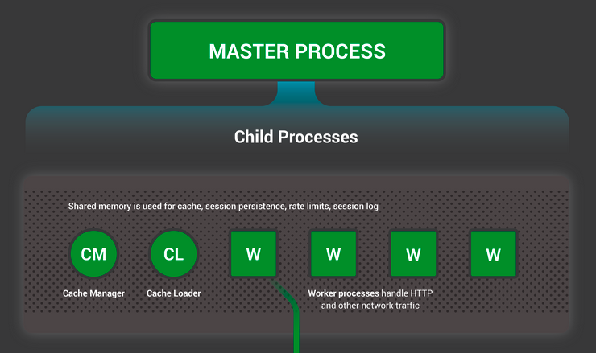

# Inside NGINX : How We Designed for Performance & Scale

https://www.nginx.com/blog/inside-nginx-how-we-designed-for-performance-scale/

NGNIX는 현재 웹 성능 분야에서 선두주자이다. 그리고 이렇게 될 수 있었던 이유는 바로 설계 디자인에 있다. 많은 웹 서버나 어플리케이션 서버들이 간단한 스레드/프로세스 기반 아키텍처를 가지는 반면, NGINX는 정교한 이벤트 기반 아키텍쳐로 수백, 수천 개의 동시 접속을 처리할 수 있다.

## NGINX Process Model


이 디자인을 제대로 이해하기 위해서는 NGINX가 어떻게 돌아가는지 이해를 해야한다. NGINX는 configuration을 읽거나 포트에 바인딩을 해주는 등 특수한 권한이 필요한 작업을 하는 master process가 있고, 여러 개의 woker 와 helper process 들로 이루어져 있다.


이 4-코어 서버에서는 NGINX master process가 디스크 위에 올라간 캐시를 관리하는 4개의 worker process를 만들고 2개의 캐시 helper 프로세스를 생성한다.

## 왜 아키텍쳐가 중요한가?
Unix 어플리케이션에서 가장 기본적인 단위는 thread/process이다. (Linux OS 관점에서는 스레드나 프로세스는 거의 같은 개념이다. 가장 큰 차이는 얼만큼 메모리를 공유하는가에 있다.)
Thread/Process는 instruction의 집합으로써 운영체제가 정한 스케줄대로 CPU core에서 동작 시킬 수 있다. 가장 복잡한 어플리케이션들은 여러개의 thread/process를 병렬로 돌리는데 그 이유는 두 가지다.

- 여러 개의 연산 코어를 동시에 사용할 수 있다.
- Thread/Process는 연산을 병렬로 처리하는 것을 매우 쉽게 한다. (예를 들어 여러 connnection을 한번에 처리한다던지)

Process와 스레드는 리소스를 소비한다. 메모리나 다른 OS 자원을 사용하며, 코어에 올렸다가 해제하기도 한다 (이 작업을 context switch라 한다).
대부분의 현대 서버들은 수백개의 작고 활성화된 thread/process를 처리할 수 있다. 하지만 남은 메모리가 없거나 대량의 I/O 연산 로드 (큰 단위의 context switch를 유발하기 때문에)가 발생하면 성능이 크게 떨어진다. 

가장 흔한  네트워크 어플리케이션 설계 방식은 connection 당 스레드/프로세스를 할당하는 것이다. 이런 아키텍쳐는 매우 간단하고 구현이 쉽지만, 어플리케이션이 수천 개의 동시 접속을 처리해야 될 때 대응하기 어렵다.

## NGINX는 어떻게 동작하는가?

NGINX는 예측가능한 프로세스 모델을 사용한다.

- master prcoess는 특수 권한이 필요한 연산들을 수행한다.
 예) configuration을 읽어서 포트에 바인딩하고, 몇 개의 child process를 생성한다.
 
 [child process의 종류]
 - Cache loader process는 초기 startup 단계에서 돌아간다. 디스크에 있는 캐시를 메모리로 올리고 종료한다. 매우 보수적으로 스케줄 되어있기 때문에 리소스 사용량이 매우 적다.
- cache manager는 주기적으로 실행되며, disk 캐시에서 메모리로 들어오는 데이터 크기를 계속해서 압축하여 설정한 일정 크기로 유지하는 작업을 한다
- worker process가 대부분의 일을 수행한다. 네트워크 connection을 관리하며, 디스크에 read/write 하며, upstream server들과 소통한다.

NGINX가 대부분의 상황에서 권장하는 설정은 CPU 코어 당 Worker process 하나를 할당하는 것이다. 이 방식이 하드웨어 자원을 가장 효과적을 사용한다. 이 설정은 다음과 같이 세팅한다.

```
worker_processes auto
```

NGINX 서버가 활성화 되어 있을때, 모든 worker process들은 busy한 상태이다. 각 worker process는 여러 개의 connection을 nonblocking 한 방식으로 처리하며, context switch 횟수를 줄인다.

각 worker process는 싱글 스레드로 독립적으로 수행되며, 새로운 connection을 받고 처리한다. 이 worker들은 공유 메모리 (공유 캐시 데이터, 세션 유지 데이터, 기타 공통 리소스 용으로 사용됨)를 통해 서로 소통할 수 있다.

## Inside the NGINX Worker Process


각 NGINX Worker prcoess는 NGINX configuration으로 초기화되며 여러 개의 listen socket을 master process로 부터 할당 받는다.

NGINX worker process는 listen socket(accept_mutex와 kernel socket sharding) 에 이벤트가 발생하는 것을 기다리는 과정부터 시작한다. 
이벤트는 새로운 connection이 발생할 때 시작된다. 이 connection들은 하나의 state machine에 배정이 된다. State machine은 HTTP state machine이 가장 많이 사용되지만, NGINX는 stream(raw TCP)용 state machine과 메일 프로토콜 (SMTP, IMAP, POP3)를 위한 state machine도 함께 구현이 되어있다.


State machine은 기본적으로 NGINX가 받은 요청에 대해 어떻게 처리해야하는지 알려주는 instruction의 집합이다. NGINX가 제공하는 기능을 수행하는 대부분의 웹서버들은 이와 비슷한 상태 기계를 사용한다(구현의 차이는 존재함).

## Scheduling the State Machine
State machine을 이해하기 위해 체스게임을 떠올리면 도움이 된다. State machine을 체스의 룰이라고 생각하면 된다. 각 HTTP transaction은 하나의 체스 게임이다. 체스판의 한 편은 웹서버가 있다. 이 웹 서버는 엄청나게 빠른 판단력을 가진 체스 그랜드 마스터와 같다. 반대편에는 remote client가 있다. 이 remote client는 사이트에 접속하고자 하는 브라우저나 어플리케이션이다.

하지만 이 게임의 룰은 매우 복잡해질 수 있다. 예를 들자면 웹서버는 다른 분야의 서버와 소통을 해야된다거나 (upstream application에 proxy) authentication 서버와 메세지를 주고 받아야 할 수 도 있다.
서버 내의 제 3자 모듈들이 참여하면 과정이 복잡해진다.

### A Blocking State Machine
스레드/프로세스를 OS가 CPU 코어 위에 올려서 실행시킬 수 있는 명령어의 집합이라고 표현한 것을 기억해보자. 대부분의 웹서버나 웹 어플리케이션은 connection당 프로세스/스레드 하나 할당 방식을 사용하여 체스 게임을 둔다. 각 프로세스/스레드는 한 게임을 끝내기 위해 필요한 명령어들을 가지고 있다. 서버가 프로세스를 실행 시킬 때, 대부분의 시간 동안 blocked 된 상태가 되어 있다. 즉, client가 다음 동작을 할 때까지 기다리고 있는 것이다.


1. 웹서버는 새로운 connection가 생길 때까지 listen socket에서 listen하고 있다. (client가 새로운 게임을 만들때까지 기다리고 있다)
2. 웹서버가 새 게임을 받으면, 게임을 진행하면서 한 번의 움직임을 한 이후 매번 상태를 block 시킨다(client가 다음 행동을 하기를 기다리면서).
3. 게임이 끝나더라도 웹서버는 계속 기다려야 할 수도 있다. Client가 새 게임을 하고 싶은지 확인을 해야하기 때문이다 (이 동작이 바로 keepalive connetion에 해당된다). 만약 connection이 close 되면 (client가 떠나거나 timeout이 발생할 때). 웹서버는 다시 새 게임이 올때까지 listen하는 상태로 돌아간다.

기억해야될 중요한 포인트는 바로 활성화된 각 connection(모든 체스 게임 한 판) 당 하나의 스레드/프로세스(체스 그랜드마스터)가 필요하다는 점이다. 이 아키텍쳐는 간단하고 제3자 제공 모듈(새로운 룰)로 확장하기 용이하다. 하지만 큰 단점이 있는데 바로 가벼운 HTTP connection이 비교적으로 훨씬 무거운 OS 객체인 스레드 하나에 매핑이 된다는 것이다. 프로그래밍 적으로는 편하지만, 리소스 측면에선 매우 낭비가 심하다.

## 진정한 Grandmaster NGINX
바둑의 다면기를 아는가? 다면기 대국에서는 한 명의 고수, 즉 그랜드 마스터가 여러 명의 하수와 동시에 바둑을 둔다. (체스에선 이를 simultatneous exhibition이라고 부름).

이것이 바로 NGINX worker process가 "체스"를 두는 방법과 똑같다. 각 worker(대부분의 경우 core 당 woker 1개임을 기억하라 )는 몇백, 아니 몇 천 개의 게임을 동시에 둘 수 있는 그랜드마스터와 같다.


1. Worker은 listen/connection socket에서 이벤트를 기다린다.
2. 이벤트가 발생하고 worker가 이를 처리한다.
	- listen socket에 도착한 이벤트는 client가 새로운 체스 게임을 만들었다는 뜻이다. Worker은 새로운 connection socket을 생성한다.
	- connection socket에 이벤트가 도착하면 이는 client가 수를 두었다는 뜻이다. Worker은 이에 대한 대응을 즉각적으로 한다.

Worker는 client가 응답할 때를 기다리기 위해 network traffic을 block 하지 않는다. Worker가 한 요청에 대한 처리를 완료하면, 처리를 기다리는 다른 게임으로 옮기거나 새로운 플레이어가 도전을 받는다.

## 왜 Blocking, Mulitprocess 아키텍쳐 보다 빠른가?

NGINX는 한 worker process 당 수백, 수천가지의 connection 을 맺는 것을 가능하게 한다. 각 새로운 connection은 새로운 file descriptor를 생성하고 작은 양의 추가 메모리를 worker process에 할당된다. 이건 connection 당 매우 작은 추가 오버헤드이다. NGINX 프로세스는 CPU에 고정되어 남아있다. 따라서, Context switching은 매우 드물게 일어나며 다른 할일이 없을 때만 일어난다.

기존의 Blocking, connection 당 process 할당 방식에선 각 connection이 매우 많은 양의 추가 리소스와 오버헤드를 필요로 한다. Context switching(한 프로세스에서 다른 프로세스로 전환)은 매우 빈번하게 일어난다.

적절한 시스템 튜닝을 사용하면, NGINX는 수십만 개의 동시 HTTP 연결을 한 woker process가 처리하게끔 할 수 있다. 추가적으로 traffic spike (일시적인 대량 유입)에 대한 대응도 할 수 있다.


## Updating Configuration and Upgrading NGINX

NGINX Configuration 업데이트는 매우 간단하고 경량화 되었으며 매우 안정화된 연산이다.
간단하게 말하면 nginx -s reload 명령어를 수행하는 것이며, disk에 있는 configuration을 확인하고 master process에 SIGHUP 시그널을 보낸다.

Master process가 SIGHUP을 받으면 다음 두 가지를 수행한다.

1. Configuration을 다시 로드 하고 새로운 세트의 woker process를 fork한다. 이 새 worker process들은 즉시 connection을 맺으며 트래픽을 처리한다.
2. 이전 worker process들을 gracefully exit하도록 신호를 보낸다. Worker process들은 새로운 connection을 받아드리는 것을 중지한다. 남아있는 HTTP request들이 모두 완료가 되면 worker process들은 connection을 완전히 종료하며(keepalive 없이), 이 connection이 닫히는 순간 worker들은 exit 한다.

이 reload 과정은 CPU와 메모리 사용량에 약간의 상승을 가져오지만, 활성된 connection이 평소에 소비하는 리소스에 비교하면 현저히 낮은 수준이다. Configuration reload는 1초에 여러 번 할 수 있다 (많은 NGINX 사용자들은 이렇게 한다). 아주 드물게 여러 개의 NGINX worker process들이 connection이 닫히기를 기다리는 과정 중 문제가 발생할 경우가 있지만 이런 경우 대부분 빠르게 해결된다.

NGINX의 binary upgrade 과정도 graceful한 configuration reload 과정과 유사한 방식으로 이루어진다. 새로운 NGINX master process가 기존 원본의 master process와 동시에 실행되고, 이 둘은 같은 listening socket을 공유한다. 두 process 모두 활성된 상태에서 각자의 worker process들이 traffic을 handle한다. 이후에 기존의 master와 할당된 worker process들에게 종료시킬 수 있다.

