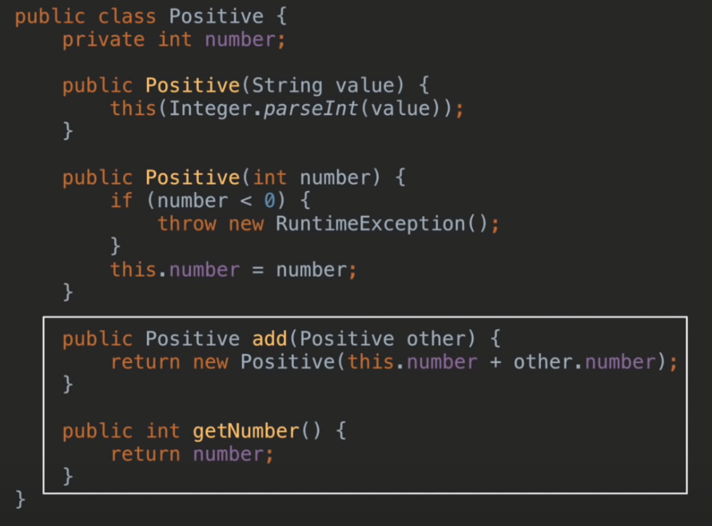

# TDD[](https://www.youtube.com/watch?v=bIeqAlmNRrA)

**의식적인 연습의 7가지 원칙**

**1.  효과적인 훈련 기법이 수립되어 있는 기술 연마
2.  개인의 컴포트 존을 벗어난 지점에서 진행, 자신의 현재 능력을 살짝 넘어가는 작업을 지속적으로 시도
3.  명확하고 구체적인 목표를 가지고 진행**
4.  신중하고 계획적이다. 즉, 개인이 온전히 집중하고 '의식적'으로 행동할 것을 요구
5.  피드백과 피드백에 따른 행동 변경을 수반
6.  효과적인 심적 표상을 만들어내는 한편으로 심적 표상에 의존
7.  기존에 습득한 기술의 특정 부분을 집중적으로 개선함으로써 발전시키고, 수정하는 과정을 수반
    from 1만시간의 재발견

주차별 학습법

1주차 - 프로그래밍 제약사항

- 자바 코드 컨벤션을 지키면서 프로그래밍한다.
- 참고문서: https://google.github.io/styleguide/javaguide.html 또는 [Https://myeonguni.tistory.com/1596](Https://myeonguni.tistory.com/1596)
- indent depth를 3이 넘지 않도록 구현. 2까지만 허용
- depth 줄이는 좋은 방법은 함수를 분리
- 함수가 한 가지 일만 하도록 최대한 작게 만들어라

2주차 - 프로그래밍 제약사항

- 함수 길이가 15라인을 넘어가지 않도록 구현
- 함수가 한 가지 일만 잘 하도록 구현
- else 쓰지 않음
- if 조건절을 return하는 방식으로 구현하면 else 사용 안해도 됨

3주차 - 프로그래밍 제약사항

- 함수의 길이가 10라인 이내
- Indent 1까지만 허용
- 함수의 인자 수 3개까지만 허용
- 객체에 메세지를 보내라
    상태 데이터를 가지는 객체에서 데이터를 get 하지 말고 객체에 메세지를 보내라.

```
private boolean isMaxPosition(Car car){
    return car.getPosition() == maxDistance;
}

//다음과 같이 변경 
private boolean isMaxPosition(Car car){
    return car.isMaxPosition(maxDistace);
}
```

# 1단계 : 단위테스트 연습

내가 사용하는 API 사용법을 익히기 위한 학습 테스트 시작

- 자바 String 클래스의 다양한 함수 사용법
- 자바 ArrayList 데이터 추가, 수정, 삭제하는 방법

```
import org.unit.Test;
import java.util.ArrayList;
import static org.assertj.core.api.Assertions.assertThat;

public class CollectionTest{
    @Test
    public void arrayList(){
        ArrayList<String> values = new ArrayList<>();
        values.add("first");
        values.add("second");
        
        assertThat(values.add("third")).isTrue();
        assertThat(values.szie()).isEqualTo(3);
        assertThat(values.get(0)).isEqualTo("first");
        assertThat(values.contains("first")).isTrue();
        assertThat(values.remove(0)).isEqualTo("first");
        assertThat(values.size()).isEqualTo(2);
    }
}
```

연습효과

- 단위테스트 방법 학습
- xUnit 사용법
- 사용하는 API에 대한 학습효과

# 2단계: TDD 연습

난이도 낮거나 자신에게 익숙한 문제로 시작하는 것을 추천

웹, 모바일 UI나 DB에 의존관계를 가지지 않는 요구사항으로 연습한다

### TDD Circle of Life

Test Fails -> Test Passes -> Refactor


켄트 백의 방법론
1. 작은 테스트를 추가
2. 모든 테스트 실행, 실패하는 것을 확인
3. 코드에 변화
4. 모든 테스트를 실행하고, 성공하는 것을 확인
5. 중복을 제거하기 위해 리팩토링


## 예시) 문자열 덧셈 계산기

| 입력 | 출력 |
| --- | --- |
| null 또는 "" | 0 |
| "1" | 1 |
| "1,2" | 3 |
| "1,2:3" | 6 |

먼저 테스트 코드 작성

```
public class StringCalculatorTest{
	@Test
	public void null_or_blank(){
		assertThat(StringCalculator.splitAndSum(null)).isEqualTo(0);
		assertThat(StringCalculator.splitAndSum("")).isEqualTo(0);
	}
	
	@Test
	public void oneVal(){
		assertThat(StringCalculator.splitAndSum("1")).isEqualTo(1);
	}
	
	@Test
	public void comma(){
		assertThat(StringCalculator.splitAndSum("1,2")).isEqualTo(3);
	}
	
	@Test
	public void comma_and_colon(){
		assertThat(StringCalculator.splitAndSum("1,2:3")).isEqualTo(6);
	}
}
```

구현
```
public class StringCalculator{
	public static int splitAndSum(String text){
		int result = 0;
		if(text == null || text.isEmpty()){
			result = 0;
		}else{
			String[] values = text.split(",|:");
			for(String value : values){
				result += Integer.parseInt(value);
			}
		}
		return result;
	}
}
```

# 3 메소드 분리 리팩토링

- 테스트 코드는 건들지 않는다
- 프로덕션 코드만 건드려라

1. 먼저 indent 줄이자
```
public class StringCalculator{
	public static int splitAndSum(String text){
		int result = 0;
		if(text == null || text.isEmpty()){
			result = 0;
		}else{
			String[] values = text.split(",|:");
			result = sum(values);
		}
		return result;
	}
	
	private static int sum(String[] values){
		int result = 0;
		for(String v : values){
			result += Integer.parseInt(value);
		}
		return result;
	}
}
```

2. else 예약어를 쓰지 않는다
```
public class StringCalculator{
	public static int splitAndSum(String text){
		int result = 0;
		if(text == null || text.isEmpty()){
			return 0;
		}
		
		String[] values = text.split(",|:");
		return sum(values);
	}
	
	private static int sum(String[] values){
		int result = 0;
		for(String v : values){
			result += Integer.parseInt(value);
		}
		return result;
	}
}
```

3. 메소드가 한가지 일만 하도록 구현
```
public class StringCalculator{
	public static int splitAndSum(String text){
		int result = 0;
		if(text == null || text.isEmpty()){
			return 0;
		}
		
		String[] values = text.split(",|:");
		return sum(values);
	}
	private static int[] toInts(String[] values){
		int[] numbers = new int[values.length];
		for(int i = 0 ; i < values.lenght; i++){
			numbers[i] = Integer.parseInt(values[i]);
		}
		return numbers;
	}
	
	private static int sum(int[] numbers){
		int result = 0;
		for(int n : numbers){
			result += n;
		}
		return result;
	}
}
```
- for문 두번 돌지만 재활용이 가능해짐

로컬변수 제거
```
public class StringCalculator{
	public static int splitAndSum(String text){
		int result = 0;
		if(text == null || text.isEmpty()){
			return 0;
		}
		
		return sum(toInts(text.split(",|:")));
	}
	private static int[] toInts(String[] values){
		int[] numbers = new int[values.length];
		for(int i = 0 ; i < values.lenght; i++){
			numbers[i] = Integer.parseInt(values[i]);
		}
		return numbers;
	}
	
	private static int sum(int[] numbers){
		int result = 0;
		for(int n : numbers){
			result += n;
		}
		return result;
	}
}
```

4. compose method 패턴
- 메소드 의도가 잘 드러나도록 동등한 수준의 작업을 하는 여러 단계로 나눈다
- 추상화 단계를 맞춰줌


# 4 클래스 분리 리팩토링
- 추가 요구사항:
- 숫자 이외의 값 또는 음수를 전달하는 경우 RuntimeException throw

| 입력 | 출력 |
| --- | --- |
| null 또는 "" | 0 |
| "1" | 1 |
| "1,2" | 3 |
| "1,2:3" | 6 |
| "-1,2:3" | RuntimeException |

- Test code 추가


- 프로덕션 코드 변경


1. 모든 primitive 와 String 포장


2. 메소드가 클래스로 분리되는지 확인


3.프로덕션 코드 변경


4. Positive add 구현




