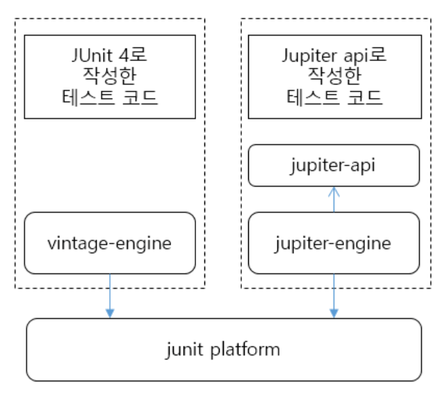

# JUnit 4 vs. JUnit 5

## 구성
JUnit4는 All in One 즉 하나의 라이브러리만 추가하면 된다.

```xml
<dependency>
    <groupId>junit</groupId>
    <artifactId>junit</artifactId>
    <version>4.12</version>
    <scope>test</scope>
</dependency>
```

그에 반해 JUnit5는 아래와 같이 3개의 모듈로 나눠져있다.

```
JUnit 5 = JUnit Platform + JUnit Jupiter + JUnit Vintage
```


- JUnit Platform - Java Unit Test를 하기위한 Launcher 제공. TestEngine API 제공
- Jupiter - JUnit 5 TestEngine API 구현체
- Vintage - JUnit 3,4 를 지원하기위한 TestEngine 구현체

| 항목 | JUnit4 | JUnit5 |
| --- | --- | --- |
| Java Version 지원 | 1.4 이상 | 1.8 이상 |
| 테스트 수행 전 실행 | @Before | @BeforeEach |
| 테스트 클래스 수행 전 실행 | @BeforeClass | @BeforeAll |
| 테스트 수행 후 실행 | @After | @AfterEach |
| @Test | public void
접근제어자 public 기본으로 사용 | void
접근제어자 Default 사용 |
| 테스트에서 제외 | @Ignore | @Disabled |

[https://pinokio0702.tistory.com/156](https://pinokio0702.tistory.com/156)