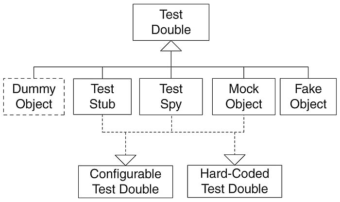

# Test Double

> 영화 촬영 시 위험한 역할을 대신하는 스턴트 더블에서 비롯됨
> 

테스트하려는 객체와 연관된 객체를 사용하기가 어렵고 모호할 때 대신해 줄 수 있는 객체를 의미한다.

## Dummy

- 인스턴스화 된 객체가 필요하지만 기능이 필요하지 않은 경우
- 빈 implementation을 가진 Wrapper 클래스로 이해하면된다.

## Fake

- 복잡한 로직이나 객체 내부에서 필요로 하는 다른 외부 객체들의 동작을 단순화하여 구체화한 객체
- 실제 클래스에 비해 간단하게만 동작하게 implements된 객체라고 이해하면됨.

## Stub

- Dummy 객체가 실제로 동작하는 것 처럼 보이게 만들어 놓은 객체
- 테스트에서 호출된 요청에 대해 미리 준비된 결과를 제공한다.

## Spy

- 실제 객체처럼 동작시킬 수 있고, 필요한 부분에 대해서는 Stub으로 만들어 동작을 지정할 수 있다.
- Stub의 특성을 가지고 있기 때문에 호출된 내용(인자) 등에 대하여 정보를 가질 수 있다.

## Mock

- 호출에 대한 기대를 명세하고 내용에 따라 동작하도록 프로그래밍된 객체

### 참고링크

- [Test Double을 알아보자](https://tecoble.techcourse.co.kr/post/2020-09-19-what-is-test-double/)