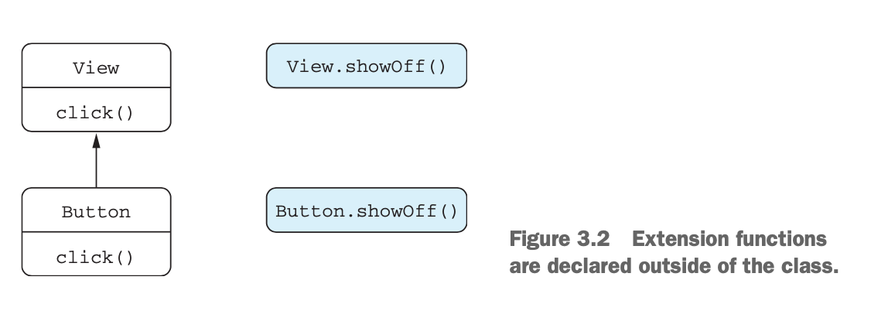

# 3장 함수 정의와 호출

- 컬렉션, 문자열, 정규식을 다루기 위한 함수
- 이름 붙인 인자, 디폴트 파라미터 값, 중위 호출 문법 사용
- 확장 함수와 확장 프로퍼티를 사용해 자바 라이브러리 적용
- 최상위 및 로컬 함수와 프로퍼티를 사용해 코드 구조화

## 3.1 코틀린에서 컬렉션 만들기

```kotlin
val set = hashSetOf(1, 7, 53)
println(set.javaClass) // class java.util.HashSet

val list = arrayListOf(1, 7, 53)
println(list.javaClass) // class java.util.ArrayList

val map = hashMap(1 to "one", 7 to "seven", 53 to "fifty-three")
println(map.javaClass) // class java.util.HashMap
```

* 코틀린은 자체 컬렉션을 제공하지 않는다.
* 자바 개발자는 기존 자바 컬렉션을 활용할 수 있으며 자바 코드와도 호환가능하다.
* 코틀린에서는 ***확장함수***를 통해 자바보다 더 많은 기능을 제공한다.

## 3.2 함수를 호출하기 쉽게 만들기

```kotlin
fun <T> joinToString(
    collection: Collection<T>,
    separator: String,
    prefix: String,
    postfix: String
): String {
    val result = StringBuilder(prefix)

    for ((index, element) in collection.withIndex()) {
        if (index > 0) result.append(separator)
        result.append(element)
    }

    result.append(postfix)
    return result.toString()
}
```

* 위 함수는 컬렉션의 원소를 원하는 접두사(prefix), 구분자(separator), 접미사(postfix)로 조합하여 출력하는 함수이다.
* 이 예시 함수를 통해 추가적인 코틀린의 기능들을 알아보자.

### 이름붙인 인자

```kotlin
joinToString(collection, " ", " ", ".")
```

* 함수 호출 부분에서 각 인자가 무엇을 뜻하는지 모르기 때문에 가독성이 좋지 않다.

```kotlin
joinToString(collection, separator = " ", prefix = " ", postfix = ".")
```

* 코틀린은 함수에 전달하는 인자에 이름을 명시하여 함수 호출 부분의 가독성을 향상시킬 수 있다.
* 이름 붙인 인자를 사용할땐 전달하는 파라미터의 순서는 지키지 않아도 된다.

### 디폴트 파라미터 값

```kotlin
fun <T> joinToString(
    collection: Collection<T>,
    separator: String = ", ",
    prefix: String = "",
    postfix: String = ""
): String ...
```

* 함수 선언에서 파라미터의 디폴트 값을 지정할 수 있다.
* 디폴트 값을 선언하였다면 해당 필드에 대하여 함수를 호출할 때 인자를 넘겨주지 않아도 사용이 가능하다.ss

```kotlin
>>> joinToString(list, ", ", "", "")
1, 2, 3
>>> joinToString(list)
1, 2, 3
>>> joinToString(list, "; ")
1; 2; 3
>>> joinToString(list, prefix = "# ", postfix = ";") // 이름붙인 인자와 조합
# 1, 2, 3;
```

* 자바에는 디폴트 파라미터 값이라는 개념이 없기 때문에, 자바에서 코틀린 함수를 사용하는 경우 디폴트 파라미터 값을 제공하더라도 모든 인자를 명시해야한다.

```kotlin
@JvmOverloads
fun <T> joinToString(...): String {
    ...
}
```

* `@JvmOverloads` 애노테이션을 함수에 선언하면 코틀린 컴파일러가 자동으로 맨 마지막 파라미터로부터 파라미터를 하나씩 생략한 오버로딩한 자바 메서드를 추가해준다.

```kotlin
public static String joinToString $default(Collection var0, String var1, String var2, String var3, int var4, Object var5) {
    if ((var4 & 2) != 0) {
    var1 = ", ";
}

    if ((var4 & 4) != 0) {
    var2 = "";
}

    if ((var4 & 8) != 0) {
    var3 = "";
}

    return joinToString(var0, var1, var2, var3);
}

@JvmOverloads
@NotNull
public static final String joinToString(@NotNull Collection collection, @NotNull String separator, @NotNull String prefix) {
    return joinToString$default(collection, separator, prefix, (String)null, 8, (Object)null);
}

@JvmOverloads
@NotNull
public static final String joinToString(@NotNull Collection collection, @NotNull String separator) {
    return joinToString$default(collection, separator, (String)null, (String)null, 12, (Object)null);
}

@JvmOverloads
@NotNull
public static final String joinToString(@NotNull Collection collection) {
    return joinToString$default(collection, (String)null, (String)null, (String)null, 14, (Object)null);
}
```

* 실제 `@JvmOverload`를 사용했을 때 생성되는 자바 바이트 코드를 확인해보면 `메서드 명$default` 메서드가 생성된다.
* 해당 메서드는 null로 값이 들어온 경우 디폴트 값으로 값을 치환해주는 역할을 한다.

### 정적인 유틸리티 클래스 없애기: 최상위 함수와 프로퍼티

자바에선 유틸리티 함수나 상수를 담는 클래스를 반드시 구현해야 했다(ex. `CollectionUtils`). 하지만 코틀린은 패키지 최상위 함수와 프로퍼티를 정의할 수 있다.

**최상위 함수**

JVM은 클래스 안에 들어있는 코드만을 실행할 수 있다. 하지만 코틀린에서는 최상위 함수라는 개념이 있다. 코틀린 컴파일러는 최상위 함수가 존재하는 파일을 컴파일할 때 새로운 클래스를 정의해주어 JVM에서 동작하도록 한다.

```kotlin
@file:JvmName("StringFunctions") // 컴파일 되면 해당 클래스 이름은 StringFunctions 이다.

package strings

fun <T> joinToString(...): String {
    ...
}
```

* 코틀린 컴파일러가 생성하는 클래스 이름은 최상위 함수가 들어있는 코틀린 소스 파일의 이름과 대응한다.
* 원하는 클래스 이름으로 지정하고 싶다면 `@JvmName`애노테이션을 통해 지정가능하다.

**최상위 프로퍼티**

```kotlin
val opCount = 0
fun performOperation() {
    opCount++
}
```

* 프로퍼티도 파일의 최상위 수준에 선언할 수 있으며, 이를 최상위 프로퍼티라고 한다.
* 이런 프로퍼티의 값은 정적 필드에 저장된다.
* 최상위 프로퍼티를 상수처럼 사용하고 싶다면 `const` 키워드를 통해 자바의 `public static final` 필드로 컴파일하게 할 수 있다.

## 3.3 메서드를 다른 클래스에 추가: 확장 함수와 확장 프로퍼티

```kotlin
fun String.lastChar(): Char = this.get(this.length - 1)
println("Kotlin".lastChar()) // n
```

- 확장함수는 어떤 클래스의 멤버 메서드인 것 처럼 호출할 수 있지만, 그 클래스의 밖에 선언된 함수이다.
- 추가하려는 함수 이름 앞에 그 함수가 확장할 클래스의 이름을 덧붙이면 된다
- `수신 객체 타입(receiver type)`: 확장이 정의될 클래스의 타입
- `수신 객체(receiver object)`: 그 클래스에 속한 인스턴스 객체
- 위의 예시에선 `String` 이 수신 객체 타입이며, 확장 함수 구현부의 `this`가 수신 객체이다.

```kotlin
fun String.lastChar(): Char = get(length - 1)
```

* 확장 함수 내부에서는 일반적인 인스턴스 메서드의 내부와 마찬가지로 수신 객체의 메서드나 프로퍼티를 바로 사용할 수 있다.
    * (`this`를 생략 가능하다)
* 하지만 클래스 안에서 정의한 메서드와 달리 확장 함수 안에서는 클래스 내부에서만 사용가능한 `private`, `protected` 멤버는 사용할 수 없다.

### 임포트와 확장 함수

```kotlin
import strings.lastChar

val c = "Kotlin".lastChar()
```

```kotlin
import strings.lastChar as last

val c = "Kotlin".last()
```

- 정의한 확장 함수를 사용하기 위해선 임포트해야만 한다.
- `as` 키워드를 사용하면 임포트한 클래스나 함수를 다른 이름으로 부를 수 있다.
- 중복되는 이름의 클래스나 함수를 임포트할 시 충돌이 있을 수 있는데 이럴땐 두가지 충돌 해결 방법이 있다.
    1. 전체 이름(FQN)을 사용한다.
    2. `as` 로 이름을 변경하여 충돌을 회피한다.

코틀린에서는 확장 함수는 짧은 이름을 쓰는것을 권장하므로 후자(as)의 충돌 해결의 방법을 권장한다.

### 자바에서 확장 함수 호출

```java
char c = StringUtilKt.lastChar("Java")
```

- 내부적으로 확장 함수는 수신 객체를 첫 번째 인자로 받는 정적 메서드이다.
- 그렇기에 확장 함수 호출에 대하여 추가 비용이 들지 않는다

### 확장 함수로 유틸리티 함수 정의

```kotlin
fun <T> Collection<T>.joinToString(
    separator: String = ", ",
    prefix: String = "",
    postfix: String = ""
): String {
    val result = StringBuilder(prefix)

    for ((index, element) in this.withIndex()) {
        if (index > 0) result.append(separator)
        result.append(element)
    }

    result.append(postfix)
    return result.toString()
}
```

- 앞서 정의했던 `joinToString` 메서드를 수신 객체 타입 `Collection<T>` 을 갖는 확장 함수로 선언한다.
- for문에서 `collection` 파라미터 대신 `this` 접근자로 수신 객체를 가리킨다 (`this`는 생략 가능)

### 확장 함수는 오버라이드할 수 없다.

```kotlin
open class View {
    open fun click() = println("View clicked")
}

class Button : View() {
    override fun click() = println("Button clicked")
}

val view: View = Button()
view.click() // Button clicked
```

- `open` 키워드는 상속을 허용하기 위해 사용한다.
- open 키워드 없이 상속할 경우 final 취급되기에 에러가 발생된다.
- 멤버 함수에 대해선 동적으로 오버라이드 한 함수가 호출된다.

```kotlin
fun View.showOff() = println("I'm a view!")
fun Button.showOff() = println("I'm a button!")

val view: View = Button()
view.showOff() // I'm a view
```


* 확장 함수는 정적 타입에 의해 함수 호출을 결정한다. 따라서 오버라이드 할 수 없다.
* 만약 같은 시그니처를 가진 멤버 함수가 있다면, 반드시 확장 함수가 아닌 멤버 함수가 호출된다.

### 확장 프로퍼티

```kotlin
val String.lastChar: Char
    get() = get(length - 1)
    set(value: Char) {
        this.setCharAt(length - 1, value)
    }
```

* 확장 프로퍼티는 프로퍼티 형식 구문으로 선언하여 사용할 수 있다.
* 프로퍼티라 불리지만 기존 클래스에 필드를 추가할 수 없으므로 실제 상태를 가지진 않는다.
* 프로퍼티 문법이 더 짧은 코드를 만들 수 있어서 사용할 때 더 편한 경우가 있다.
* 확장 프로퍼티를 사용하는 방법은 멤버 프로퍼티 사용 방법과 같다.

## 3.4 컬렉션 처리: 가변 길이 인자, 중위 함수 호출, 라이브러리 지원

### 자바 컬렉션 API 확장

코틀린은 확장 함수를 통해 자바와 같은 클래스를 사용하지만 더 확장된 API를 제공할 수 있다.

### 가변 인자 함수: 인자의 개수가 달라질 수 있는 함수 정의

```kotlin
fun listOf<T>(vararg values: T): List<T> {
    ...
}
```

* 코틀린은 `vararg` 키워드를 통해 가변인자를 지원한다.

```kotlin
fun main(args: Array<String>) {
    listOf("args: ", *args)
}
```

* `*` 스프레드(spread) 연산자를 통해 배열의 원소를 펼쳐서 가변 인자로 사용할 수 있다.

### 값의 쌍 다루기: 중위 호출(infix)과 구조 분해 선언

```kotlin
infix fun Any.to(other: Any) = Pair(this, other)

val (number, name) = 1 to "one" // == Pair(1, "one")
```

* 중위 호출(infix call)은 은 수신 객체와 유일한 메서드 인자 사이에 메서드 이름을 넣어 사용한다.
  * 인자가 하나뿐인 메서드나 확장 함수에서만 중위 호출을 사용할 수 있다.
* 메서드에 중위 호출을 허용하고 싶다면 `infix` 변경자를 함수 선언앞에 추가해야한다. 
* 위의 `to` 함수는 두 원소를 통해 `Pair`의 인스턴스를 반환한다.
* `1 to “one”`으로 number와 name 변수를 초기화 하는 방법을 구조 분해 선언(destructing declaration)이라고 한다.

## 3.5 문자열과 정규식 다루기

코틀린에서 제공하는 String 클래스의 확장 함수들에 대한 소개이다.

### 문자열 나누기

```kotlin
println("12.345-6.A".split("\\.|-".toRegex()) // [12, 345, 6, A]
println ("12.345-6.A".split(".", "-")) // [12, 345, 6, A]
```

- 정규식을 파라미터로 받을 때 문자열이 아닌 `Regex` 타입의 값으로 받아 처리하는 API 제공
- 구분 문자열을 하나 이상 인자로 받는 API 제공

### 정규식과 3중 따옴표로 묶은 문자열

```kotlin
val kotlinLogo = """
    ||  //
    || //
    ||//\\
    |//  \\
""".trimIndent()
```

* 코틀린에선 3중 따옴표 문자열을 쓸 수 있다.
* 3중 따옴표 문자열에선 이스케이프 문자를 사용할 필요가 없으며, 공백과 줄바꿈이 모두 인식된다.
* `trimIndent()`를 통해 선언 시 가독성을 위해 생성된 탭을 사용시엔 자동으로 제거해준다.

### 코드 다듬기: 로컬 함수와 확장

클래스에 기능이 많아질 수록 중복되는 코드가 발생할 수 있다. 하지만 이를 추가적인 메서드로 리패토링하면 클래스 안에 작은 메서드들이 많아지고 각 메서드 사이 관계를 파악하기 힘들어지게된다.

코틀린은 로컬 함수를 통해 이를 해결한다.

```kotlin
class User(val id: Int, val name: String, val address: String)

fun saveUser(user: User) {
    fun validate(value: String, fieldName: String) {
        if (value.isEmpty()) {
            throw IllegalArgumentException("Can't save user ${user.id}: empty ${fieldName}")
        }
    }

    validate(user.name, "Name")
    validate(user.address, "Address")

    // save ...
} 
```

- `saveUser` 함수 내 `validate`라는 로컬 함수를 선언하였다.
- 중복을 없애며 `saveUser` 메서드 내 선언되어 코드 구조를 깔끔하게 유지할 수 있다.
- 로컬 함수 자신이 속한 바깥 함수의 모든 파라미터와 변수를 사용할 수 있다.

```kotlin
fun User.validateBeforeSave() {
    fun validate(value: String, fieldName: String) {
        if (value.isEmpty()) {
            throw IllegalArgumentException("Can't save user ${user.id}: empty ${fieldName}")
        }
    }

    validate(user.name, "Name")
    validate(user.address, "Address")
} 
```

- 응집도를 위해 User 메서드 내부에 검증 로직을 혼재하고 싶지 않다면 확장 함수로 만들 수 있다.